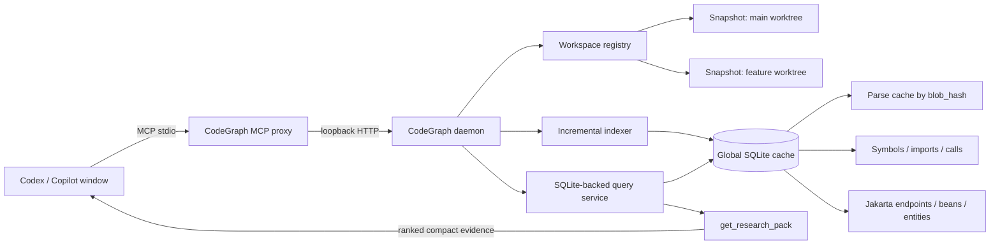
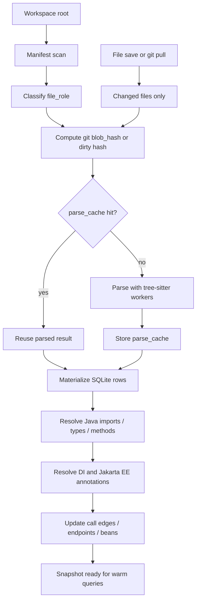
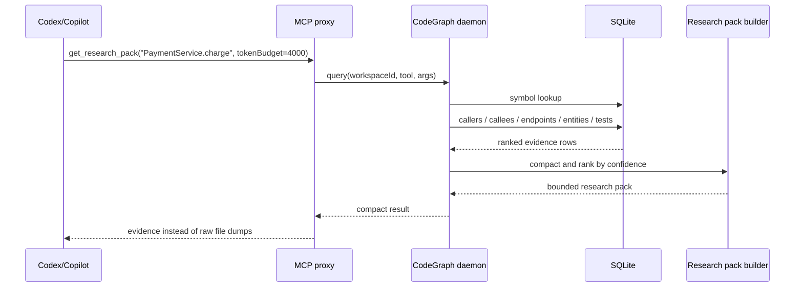
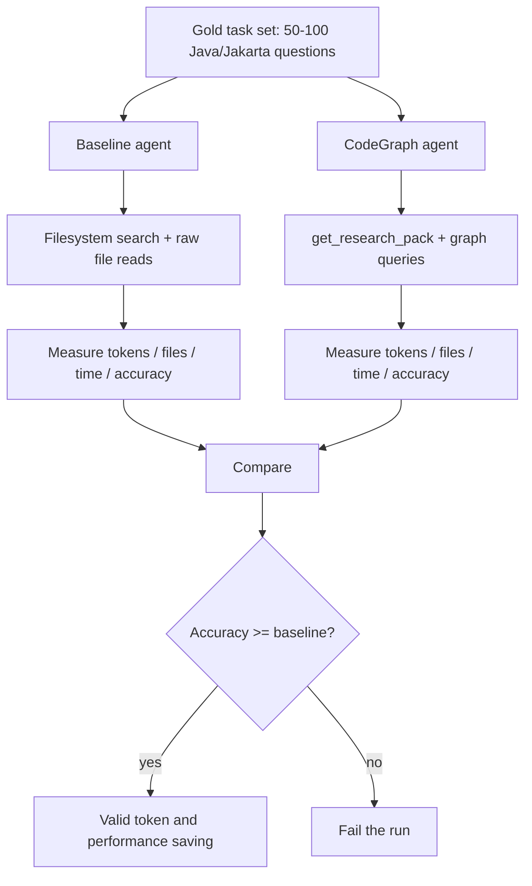

# codegraph

CodeGraph v2 MCP proxy and persistent semantic indexer for GitHub Copilot/Codex agents.

The runtime is v2-only: `node dist/cli.js mcp --root <workspace>` starts an MCP stdio proxy, auto-starts a local daemon, and uses a global SQLite cache for incremental indexing across repos, worktrees, and clones.

Java/Jakarta EE is the primary semantic target. TypeScript/JavaScript and Python parsing remain available through the shared tree-sitter analyzer.

---

## Tools

| Tool | Description |
|------|-------------|
| `search_symbol` | Search indexed symbols by name/kind |
| `search_files` | Find relevant files with top symbols/endpoints and rank evidence |
| `search_code` | Mixed retrieval across files, symbols, endpoints, references, and dependencies |
| `find_references` | Find definitions, imports, and call references |
| `get_file_summary` | Summarize symbols, imports, dependencies, and dependents for a file |
| `get_dependencies` | List direct dependencies for a file/module |
| `get_dependents` | List direct dependents for a file/module |
| `trace_dependencies` | Trace direct/transitive dependencies or dependents |
| `get_callers` | Find callers of a symbol |
| `get_callees` | Find callees from a symbol |
| `find_endpoints` | Find Jakarta/Spring endpoint handlers |
| `get_impact_radius` | Estimate blast radius for a target |
| `get_research_pack` | Return compact ranked evidence for agent research |
| `get_index_stats` | Inspect current snapshot counts and file roles |

Graph edges and research packs include confidence notes when resolution is fuzzy or incomplete.

---

## Quick Start

New to this tool or setting up a fresh machine? Follow this Quick Start from top to bottom before configuring your editor.

### Prerequisites

- **Node.js 20+** — check with `node --version`
- **npm** — bundled with Node.js

### 1. Install & Build

```bash
git clone <repo>
cd code-graph
npm install
npm run build
```

### 2. Run CodeGraph

Prewarm a workspace into the persistent index:

```bash
node dist/cli.js index --root /path/to/your/project
```

Run the MCP stdio proxy:

```bash
node dist/cli.js mcp --root /path/to/your/project
```

This starts an MCP stdio proxy, auto-starts the local daemon, and registers the `--root` workspace in the persistent SQLite index.

Inspect local daemon/cache health:

```bash
node dist/cli.js doctor
```

### Windows Multi-Repo Smoke Test

Use quotes around Windows paths. Test with `index` first; `mcp` is an MCP stdio process and normally waits for an editor/client instead of printing a success message.

```powershell
cd C:\path\to\code-graph
npm install
npm run build

# Optional isolated cache for testing. Omit --home for normal daily use.
$cgHome = Join-Path $env:TEMP "codegraph-smoke-home"
Remove-Item -LiteralPath $cgHome -Recurse -Force -ErrorAction SilentlyContinue

node .\dist\cli.js doctor --home $cgHome

node .\dist\cli.js index `
  --root "C:\path\to\project-a" `
  --home $cgHome

node .\dist\cli.js index `
  --root "C:\path\to\project-b" `
  --home $cgHome
```

Run the same `index` commands again to verify warm-cache behavior. A warm run should show `filesParsed` near `0` and `parseCacheHits` near `filesTotal`.

### Verify That The MCP Is Being Used

The most reliable signal is the CodeGraph daemon log. If an agent actually calls a CodeGraph MCP tool, the log will contain `event: "query"` and a `toolName` such as `get_research_pack`, `search_symbol`, or `get_index_stats`.

```powershell
cd C:\path\to\code-graph

node .\dist\cli.js doctor
node .\dist\cli.js logs --tail 20
```

To watch the log live in PowerShell:

```powershell
$info = node .\dist\cli.js doctor | ConvertFrom-Json
Get-Content -LiteralPath $info.daemonLogPath -Tail 20 -Wait
```

Then ask the agent a direct MCP-only check:

```text
Use codegraph MCP tool get_index_stats and tell me the indexed file count.
```

or:

```text
Use codegraph MCP get_research_pack for PaymentService with tokenBudget 2000. Do not use shell search first.
```

Expected log line:

```json
{"event":"query","toolName":"get_research_pack","args":{"target":"PaymentService","tokenBudget":2000},"durationMs":5,"responseChars":2588}
```

If the UI only shows shell commands, file reads, or text search and the CodeGraph log has no `query` event, the agent did not use CodeGraph for that step.

---

## Integrate with VS Code / GitHub Copilot

Add to your project's `.vscode/settings.json`:

```jsonc
{
  "mcp": {
    "servers": {
      "code-graph": {
        "type": "stdio",
        "command": "node",
        "args": [
          "/absolute/path/to/code-graph/dist/cli.js",
          "mcp",
          "--root",
          "${workspaceFolder}"
        ]
      }
    }
  }
}
```

> Replace `/absolute/path/to/code-graph` with the actual path where you cloned this repo. On Windows, forward slashes are OK, for example `C:/path/to/code-graph/dist/cli.js`.

If VS Code logs `Cannot find module`, the configured path is stale or points at a different clone. Verify that the configured file exists:

```jsonc
"C:/path/to/code-graph/dist/cli.js"
```

Use `${workspaceFolder}` for `--root` when possible. Then each VS Code/Copilot window automatically indexes the folder opened in that window:

```jsonc
{
  "mcp": {
    "servers": {
      "code-graph": {
        "type": "stdio",
        "command": "node",
        "args": [
          "C:/path/to/code-graph/dist/cli.js",
          "mcp",
          "--root",
          "${workspaceFolder}"
        ]
      }
    }
  }
}
```

For a hard-coded project root, use a dedicated server name:

```jsonc
{
  "mcp": {
    "servers": {
      "code-graph-project-a": {
        "type": "stdio",
        "command": "node",
        "args": [
          "C:/path/to/code-graph/dist/cli.js",
          "mcp",
          "--root",
          "C:/path/to/project-a"
        ]
      }
    }
  }
}
```

Avoid pointing VS Code at an old clone or stale compiled entrypoint. The supported entrypoint is `dist/cli.js`.

---

## Multi-window and multi-branch usage

v2 uses one local daemon with a global SQLite cache, while each MCP stdio proxy is scoped to the `--root` passed by the editor window. You do not need one daemon per repo or branch. You only need to make sure each editor/agent window starts CodeGraph with the correct workspace root.

Keep these paths mentally separate:

| Path | Meaning | Example |
|------|---------|---------|
| CodeGraph install | This tool's repo | `C:/path/to/code-graph` |
| Workspace root | The project or branch the agent should inspect | `C:/path/to/project-a` |
| CodeGraph cache | Shared SQLite/cache/daemon state | Managed by CodeGraph, shown by `doctor` |

| Scenario | Recommended v2 setup |
|----------|----------------------|
| One repo/window | Use `dist/cli.js mcp --root "${workspaceFolder}"`. |
| Many different repos | Open each repo in its own window using the same MCP config with `${workspaceFolder}`. Each window registers a different root with the daemon. |
| Same branch/many windows | Multiple windows can point at the same root. They share the daemon and persistent warm cache. |
| Multiple branches at the same time | Use separate `git worktree` directories or separate clones. Each branch must have a different filesystem root. |
| Docker/WSL/shared access | Prefer stdio by launching `dist/cli.js mcp --root /workspace` inside the target environment. |

### Multiple Projects

Example folder layout:

```text
C:/path/to/code-graph
C:/path/to/project-a
C:/path/to/project-b
C:/path/to/project-c
```

Build CodeGraph once:

```powershell
cd "C:\path\to\code-graph"
npm install
npm run build
```

Optional but useful: prewarm each project index once:

```powershell
node .\dist\cli.js index --root "C:\path\to\project-a"
node .\dist\cli.js index --root "C:\path\to\project-b"
node .\dist\cli.js index --root "C:\path\to\project-c"
```

Recommended VS Code setup: put the same `.vscode/settings.json` in each project and use `${workspaceFolder}`:

```jsonc
{
  "mcp": {
    "servers": {
      "code-graph": {
        "type": "stdio",
        "command": "node",
        "args": [
          "C:/path/to/code-graph/dist/cli.js",
          "mcp",
          "--root",
          "${workspaceFolder}"
        ]
      }
    }
  }
}
```

Then open each project in its own VS Code window:

```powershell
code "C:\path\to\project-a"
code "C:\path\to\project-b"
code "C:\path\to\project-c"
```

Each window starts its own stdio MCP proxy, but they share the same daemon/cache. The root is different because `${workspaceFolder}` expands to the folder opened in that window.

### One Project, Multiple Branches

If you need two branches open at the same time, do not keep switching branches in one folder. Use `git worktree` so each branch has its own directory.

Start from your normal repo:

```powershell
cd "C:\path\to\your-repo"
git fetch
```

Create one folder for `main` and one folder for your feature branch:

```powershell
git worktree add "..\your-repo-main" main
git worktree add "..\your-repo-feature-search" feature/search
```

Now you have separate roots:

```text
C:/path/to/your-repo-main
C:/path/to/your-repo-feature-search
```

Prewarm both:

```powershell
cd "C:\path\to\code-graph"
node .\dist\cli.js index --root "C:\path\to\your-repo-main"
node .\dist\cli.js index --root "C:\path\to\your-repo-feature-search"
```

Open each branch folder in a separate editor window:

```powershell
code "C:\path\to\your-repo-main"
code "C:\path\to\your-repo-feature-search"
```

Use the same `${workspaceFolder}` MCP config in both worktree folders. This avoids stale or cross-branch answers because each branch has a different filesystem root.

### Hard-Coded Roots

Use `${workspaceFolder}` when possible. Hard-code roots only when you intentionally want a named MCP server for a specific project/branch.

Example with two hard-coded projects:

```jsonc
{
  "mcp": {
    "servers": {
      "code-graph-project-a": {
        "type": "stdio",
        "command": "node",
        "args": [
          "C:/path/to/code-graph/dist/cli.js",
          "mcp",
          "--root",
          "C:/path/to/project-a"
        ]
      },
      "code-graph-project-b": {
        "type": "stdio",
        "command": "node",
        "args": [
          "C:/path/to/code-graph/dist/cli.js",
          "mcp",
          "--root",
          "C:/path/to/project-b"
        ]
      }
    }
  }
}
```

Example with two branches:

```jsonc
{
  "mcp": {
    "servers": {
      "code-graph-repo-main": {
        "type": "stdio",
        "command": "node",
        "args": [
          "C:/path/to/code-graph/dist/cli.js",
          "mcp",
          "--root",
          "C:/path/to/your-repo-main"
        ]
      },
      "code-graph-repo-feature": {
        "type": "stdio",
        "command": "node",
        "args": [
          "C:/path/to/code-graph/dist/cli.js",
          "mcp",
          "--root",
          "C:/path/to/your-repo-feature-search"
        ]
      }
    }
  }
}
```

### Codex CLI Multi-Project Config

If you use Codex CLI outside VS Code, add one MCP server per project/branch to your Codex config, usually:

```text
C:/Users/<your-user>/.codex/config.toml
```

Example:

```toml
[mcp_servers.code_graph_project_a]
command = "node"
args = [
  "C:/path/to/code-graph/dist/cli.js",
  "mcp",
  "--root",
  "C:/path/to/project-a"
]

[mcp_servers.code_graph_project_b]
command = "node"
args = [
  "C:/path/to/code-graph/dist/cli.js",
  "mcp",
  "--root",
  "C:/path/to/project-b"
]
```

For multi-branch worktrees:

```toml
[mcp_servers.code_graph_repo_main]
command = "node"
args = [
  "C:/path/to/code-graph/dist/cli.js",
  "mcp",
  "--root",
  "C:/path/to/your-repo-main"
]

[mcp_servers.code_graph_repo_feature]
command = "node"
args = [
  "C:/path/to/code-graph/dist/cli.js",
  "mcp",
  "--root",
  "C:/path/to/your-repo-feature-search"
]
```

Restart Codex CLI after changing the config.

### Verify The Active Root

Ask the agent a direct MCP-only check:

```text
Use codegraph MCP tool get_index_stats and tell me the indexed file count.
```

Then check the daemon log:

```powershell
cd "C:\path\to\code-graph"
node .\dist\cli.js logs --tail 50
```

If you see `"event":"query"`, the agent called CodeGraph. If answers look like the wrong project or branch, check:

- Which folder is open in VS Code.
- Whether `.vscode/settings.json` uses `${workspaceFolder}` or a hard-coded `--root`.
- Whether the hard-coded `--root` points at the intended worktree folder.
- Whether you restarted VS Code/Codex after changing MCP config.

Quick checklist:

- Multiple projects: open each project in a separate window, preferably with `${workspaceFolder}`.
- Multiple branches at the same time: use `git worktree` or separate clones.
- Do not use the same filesystem folder for two branches open at once.
- Use a different hard-coded server name per project/branch when not using `${workspaceFolder}`.
- Run `index --root <path>` once per project/branch to prewarm the cache.

Each editor window normally starts its own stdio proxy, so you usually do not run `mcp` manually. The important part is that each project/branch passes the correct `--root`.

---

## Performance model

- SQLite is the source of truth; the daemon does not load the full graph object model into memory.
- Cold indexing scans the manifest, classifies `file_role`, hashes files, parses cache misses, and materializes symbols/imports/calls/endpoints into SQLite.
- Warm indexing reuses unchanged snapshot rows and `parse_cache` entries keyed by `blob_hash`.
- Multiple windows/repositories share the same daemon and global cache, but each `--root` has its own workspace snapshot.
- Search is fastest and most accurate when agents use graph tools first, especially `get_research_pack`, then fall back to broad text search only for unresolved names.

---

## Docker

Docker is optional. v2 normally runs best as a local stdio command from VS Code/Codex, but the image can be used when the workspace must be mounted into a container.

```bash
# Build only
./docker-build.sh

# Build + export to tar.gz (for transfer to WSL / another machine)
./docker-build.sh --export

# Build + run the MCP stdio proxy against a project
./docker-build.sh --run /path/to/your/project
```

Run manually:

```bash
docker build -t mcp-code-graph .

docker run --rm -i \
  -v "/absolute/path/to/project:/workspace:ro" \
  mcp-code-graph \
  mcp --root /workspace
```

VS Code MCP config using Docker:

```jsonc
{
  "mcp": {
    "servers": {
      "code-graph": {
        "type": "stdio",
        "command": "docker",
        "args": [
          "run",
          "--rm",
          "-i",
          "-v",
          "${workspaceFolder}:/workspace:ro",
          "mcp-code-graph:latest",
          "mcp",
          "--root",
          "/workspace"
        ]
      }
    }
  }
}
```

---

## CLI Reference

```
codegraph mcp --root <workspace>       Run MCP stdio proxy and auto-start daemon
codegraph daemon start|stop|status     Manage local daemon
codegraph daemon run                   Run daemon in the foreground
codegraph index --root <workspace>     Prewarm persistent index
codegraph doctor                       Inspect local configuration
codegraph benchmark generate|index     Generate synthetic Java repos and measure indexing

Options:
  --root <path>                        Workspace root
  --home <path>                        Override CODEGRAPH_HOME
  --port <number>                      Daemon port for daemon run
```

**Examples:**

```bash
# Prewarm a Java/Jakarta project
node dist/cli.js index --root /path/to/project

# Run MCP stdio proxy
node dist/cli.js mcp --root /path/to/project

# Use an isolated cache for benchmark/proof runs
node dist/cli.js benchmark index --root /path/to/project --home /tmp/codegraph-proof-home
```

---

## Development

```bash
npm run dev -- mcp --root /path/to/project # Run CLI with tsx
npm run build                             # Compile TypeScript → dist/
npm test                                  # Run test suite
npm run test:watch                        # Watch mode
npm run lint                              # Type-check only
```

---

## Enterprise Indexer

CodeGraph uses a local daemon, global SQLite cache, per-workspace snapshots, file-content parse-cache reuse, and a stdio proxy command intended for Copilot/Codex multi-window usage.

```bash
npm run build

# Prewarm a workspace into the persistent SQLite index
node dist/cli.js index --root /path/to/java-enterprise-repo

# Use as the MCP command from VS Code/Codex
node dist/cli.js mcp --root /path/to/java-enterprise-repo

# Inspect daemon/storage health
node dist/cli.js doctor
```

VS Code/Copilot MCP config:

```jsonc
{
  "mcp": {
    "servers": {
      "code-graph": {
        "type": "stdio",
        "command": "node",
        "args": [
          "/absolute/path/to/code-graph/dist/cli.js",
          "mcp",
          "--root",
          "${workspaceFolder}"
        ]
      }
    }
  }
}
```

Storage defaults to `CODEGRAPH_HOME` or the OS user state/cache directory. The daemon manages one logical workspace per root/worktree/clone and reuses parse cache by file content hash across branches and clones.

Benchmark helpers:

```bash
# Generate a synthetic Java/Jakarta repo
node dist/cli.js benchmark generate --root /tmp/synth-java --files 10000 --modules 10

# Measure persistent index performance
node dist/cli.js benchmark index --root /tmp/synth-java
```

### v2 Operating Principle

The v2 design optimizes for agent research on large Java/Jakarta repositories. Instead of asking an agent to open many files and infer relationships from raw text, CodeGraph keeps a persistent semantic index and returns a compact, ranked research pack.



The indexer is staged so saves and pulls update only the affected slice of the graph.



Agent queries should prefer `get_research_pack` over broad file reads.



### Proving Token Savings, Performance, and Accuracy

Token savings are only valid when answer quality stays equal or improves. A smaller context that produces worse answers is a failed optimization.



Use the same repository, same task set, same agent, and same time limits for both modes:

| Dimension | Baseline | CodeGraph mode | Success signal |
|-----------|----------|----------------|----------------|
| Context usage | Agent opens/searches files directly | Agent asks graph tools first | 40-70% fewer context tokens |
| File reads | Count opened files and returned lines | Count graph tool calls and returned evidence | 50%+ fewer files opened |
| Performance | Wall time and tool latency | Warm query/research-pack latency | p95 under target thresholds |
| Accuracy | Gold-set correctness | Gold-set correctness | Equal or better than baseline |
| Evidence quality | Raw snippets from many files | Ranked evidence with confidence and provenance | Fewer unsupported claims |

Recommended formula:

```text
token_saving_pct = 1 - (tokens_with_codegraph / tokens_baseline)
```

For exact proof, capture model/API token usage where available. When exact token counts are unavailable, log tool responses and estimate context tokens consistently, for example `ceil(char_count / 4)`, then use the same estimator for both modes.

Minimum evaluation dataset:

```text
1. Who calls PaymentService.charge()?
2. Which endpoints are affected by changing UserEntity.email?
3. What controller/service/entity path handles POST /orders?
4. Which bean implementations can satisfy this interface injection?
5. Which tests are most relevant for this service method?
```

Metrics to report:

| Metric | Target |
|--------|--------|
| Warm query latency p95 | <200ms |
| `get_research_pack` p95 | <2s |
| Single saved Java file update | <1s |
| Pull update with <500 changed files | <30s |
| Java call edge precision | >85% |
| Jakarta endpoint recall | >95% |
| Impact top-5 recall | >90% |
| Agent context token reduction | 40-70% |
| Agent file-open reduction | 50%+ |

### Proof Runbook

Use an isolated `CODEGRAPH_HOME` for proof runs so benchmark data does not mix with normal development data.

PowerShell setup:

```powershell
npm install
npm run build

$proofRoot = Join-Path $env:TEMP "codegraph-proof"
$cgHome = Join-Path $env:TEMP "codegraph-proof-home"
Remove-Item -LiteralPath $proofRoot, $cgHome -Recurse -Force -ErrorAction SilentlyContinue
New-Item -ItemType Directory -Force -Path $proofRoot, $cgHome | Out-Null
```

Run synthetic scale benchmarks:

```powershell
foreach ($files in 10000, 30000, 60000) {
  $repo = Join-Path $proofRoot "synth-$files"

  node dist/cli.js benchmark generate `
    --root $repo `
    --files $files `
    --modules ([Math]::Max(1, [int]($files / 1000)))

  $sw = [Diagnostics.Stopwatch]::StartNew()
  $cold = node dist/cli.js benchmark index --root $repo --home $cgHome | ConvertFrom-Json
  $sw.Stop()

  [pscustomobject]@{
    files = $files
    run = "cold"
    wallMs = $sw.ElapsedMilliseconds
    indexTimeMs = $cold.result.indexTimeMs
    manifestScanMs = $cold.result.manifestScanMs
    filesParsed = $cold.result.filesParsed
    parseCacheHits = $cold.result.parseCacheHits
    peakRssMb = $cold.peakRssMb
  } | Format-List

  $sw = [Diagnostics.Stopwatch]::StartNew()
  $warm = node dist/cli.js benchmark index --root $repo --home $cgHome | ConvertFrom-Json
  $sw.Stop()

  [pscustomobject]@{
    files = $files
    run = "warm"
    wallMs = $sw.ElapsedMilliseconds
    indexTimeMs = $warm.result.indexTimeMs
    manifestScanMs = $warm.result.manifestScanMs
    filesParsed = $warm.result.filesParsed
    parseCacheHits = $warm.result.parseCacheHits
    peakRssMb = $warm.peakRssMb
  } | Format-List
}
```

Expected signal:

```text
cold run: filesParsed is high, parseCacheHits is low
warm run: filesParsed should drop sharply, parseCacheHits should be high
peakRssMb should stay below the 2GB target for 60k files
```

Measure a single-file incremental update:

```powershell
$repo = Join-Path $proofRoot "synth-10000"
$file = Get-ChildItem -LiteralPath $repo -Recurse -Filter "Service0_0.java" | Select-Object -First 1
Add-Content -LiteralPath $file.FullName -Value "`n// proof touch"

$sw = [Diagnostics.Stopwatch]::StartNew()
$update = node dist/cli.js benchmark index --root $repo --home $cgHome | ConvertFrom-Json
$sw.Stop()

[pscustomobject]@{
  run = "single-file-update"
  wallMs = $sw.ElapsedMilliseconds
  indexTimeMs = $update.result.indexTimeMs
  filesParsed = $update.result.filesParsed
  parseCacheHits = $update.result.parseCacheHits
  peakRssMb = $update.peakRssMb
} | Format-List
```

Expected signal:

```text
filesParsed should be close to 1
wallMs should trend toward the <1s target on a warmed repo
```

Measure warm query and `get_research_pack` latency:

```powershell
$repo = Join-Path $proofRoot "synth-10000"
node dist/cli.js daemon start --home $cgHome

@'
import { DaemonClient } from "./dist/v2/daemon/client.js";

const [homeDir, root] = process.argv.slice(2);
const info = DaemonClient.readInfo(homeDir);
if (!info) throw new Error("Daemon is not running");

const client = new DaemonClient(info);
const workspace = await client.registerWorkspace(root);
await client.refreshWorkspace(root);

const samples = [];
let responseChars = 0;

for (let i = 0; i < 100; i++) {
  const start = performance.now();
  const result = await client.query(workspace.workspaceId, "get_research_pack", {
    target: "Service0_0",
    taskType: "impact",
    tokenBudget: 4000
  });
  samples.push(performance.now() - start);
  responseChars += JSON.stringify(result).length;
}

samples.sort((a, b) => a - b);
const p50 = samples[Math.floor(samples.length * 0.50)];
const p95 = samples[Math.floor(samples.length * 0.95)];
const avgChars = Math.round(responseChars / samples.length);

console.log(JSON.stringify({
  samples: samples.length,
  p50Ms: Math.round(p50),
  p95Ms: Math.round(p95),
  avgResponseChars: avgChars,
  estimatedResponseTokens: Math.ceil(avgChars / 4)
}, null, 2));
'@ | node --input-type=module - $cgHome $repo

node dist/cli.js daemon stop --home $cgHome
```

Expected signal:

```text
p95Ms should be below 2000ms for get_research_pack
estimatedResponseTokens should stay inside the requested tokenBudget
```

To prove token savings and accuracy with a real agent, run the same gold-set tasks twice:

```text
Run A: disable CodeGraph MCP, allow normal filesystem search/read tools.
Run B: enable CodeGraph MCP, require graph tools first, especially get_research_pack.
```

For each task, record:

```text
task_id
repo
mode: baseline | codegraph
answer_correct: true | false
input_tokens
output_tokens
tool_response_chars
estimated_tool_tokens = ceil(tool_response_chars / 4)
files_opened
elapsed_ms
```

A result only passes if:

```text
correctness_codegraph >= correctness_baseline
tokens_codegraph < tokens_baseline
files_opened_codegraph < files_opened_baseline
```

Example report shape:

```text
Task                    Baseline tokens   CodeGraph tokens   Saving   Correct
Payment callers         42000             9500               77%      yes
POST /orders path       55000             14000              74%      yes
UserEntity impact       80000             22000              72%      yes
```

**Run demo scripts** (requires `npm run build` first):

```bash
node demo.mjs              # Spring Boot sample project
node demo-jakartaee.mjs    # Jakarta EE MVC sample
node demo-ecommerce.mjs    # Jakarta EE Servlet + JPA
```

---

## Supported Languages & Framework Detection

### Java

| Feature | Details |
|---------|---------|
| Symbols | classes, interfaces, enums, records, fields, methods, constructors |
| Imports | full package path resolution |
| Call graph | method calls, method references (`User::getName`) |
| Framework roles | Spring Boot, Jakarta EE, JUnit 5/4, Mockito, Lombok |
| Annotation filters | `search_symbol` accepts `annotation` and `frameworkRole` params |

**Framework roles** detectable via `search_symbol { frameworkRole: "..." }`:

| Role | Annotations |
|------|------------|
| `spring:rest-controller` | `@RestController` |
| `spring:endpoint` | `@GetMapping`, `@PostMapping`, `@PutMapping`, etc. |
| `spring:service` | `@Service` |
| `spring:transactional` | `@Transactional` |
| `mvc:controller` | `@Controller` + `@Path` (Jakarta MVC) |
| `jaxrs:endpoint` | `@GET`, `@POST`, `@PUT`, `@DELETE`, `@PATCH` |
| `jaxrs:provider` | `@Provider` (ExceptionMapper, ParamConverter) |
| `jakarta:entity` | `@Entity` |
| `jakarta:stateless` | `@Stateless` |
| `jakarta:singleton` | `@Singleton` + `@Startup` |
| `jakarta:web-servlet` | `@WebServlet` |
| `jakarta:web-filter` | `@WebFilter` |
| `jakarta:lifecycle` | `@PrePersist`, `@PostConstruct`, etc. |
| `jakarta:validation` | `@NotNull`, `@Size`, `@Email`, etc. |
| `test:test` | `@Test` (JUnit 5/4) |
| `test:mock` | `@Mock`, `@MockBean` (Mockito) |
| `lombok:data` | `@Data` |
| `lombok:builder` | `@Builder` |

### TypeScript / JavaScript

| Feature | Details |
|---------|---------|
| Symbols | classes, interfaces, functions, arrow functions, methods |
| Imports | `import`/`require`, resolves relative paths |
| Call graph | function and method calls |

### Python

| Feature | Details |
|---------|---------|
| Symbols | classes, functions, methods |
| Imports | `import`/`from...import` |
| Call graph | function and method calls |

---

## Architecture

```
src/
├── cli.ts                     # v2 CLI entrypoint
├── analyzers/
│   ├── base-analyzer.ts       # Interfaces: SymbolInfo, ParseResult, TypeRefInfo
│   ├── language-detector.ts   # File extension -> language mapping
│   ├── tree-sitter-analyzer.ts # AST parsing for Java, TS, Python
│   └── java-framework-detector.ts  # Annotation -> framework role mapping + Lombok synthesis
├── v2/
│   ├── benchmark/             # Synthetic repo generation and benchmark helpers
│   ├── daemon/                # Local daemon, auth token, workspace registration
│   ├── index/                 # Manifest scan, parse cache, materialization, watcher
│   ├── mcp/                   # MCP stdio proxy and tool definitions
│   ├── query/                 # SQLite-backed queries and research pack builder
│   └── storage/               # SQLite schema and migrations
└── utils/
    └── path-guard.ts          # Directory traversal prevention
```

---

## License

MIT
