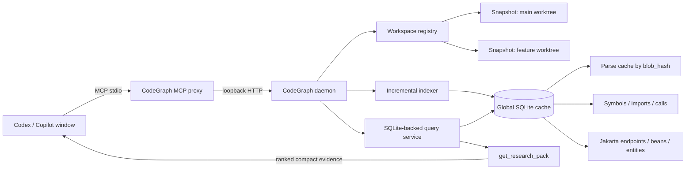
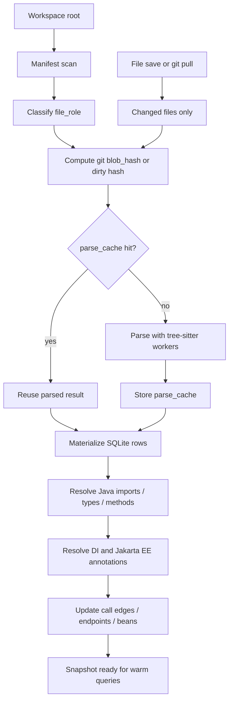
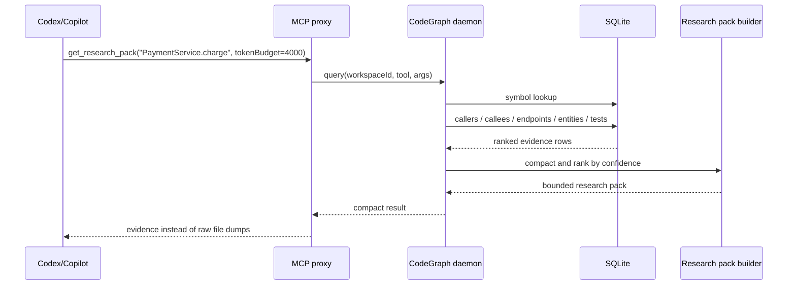
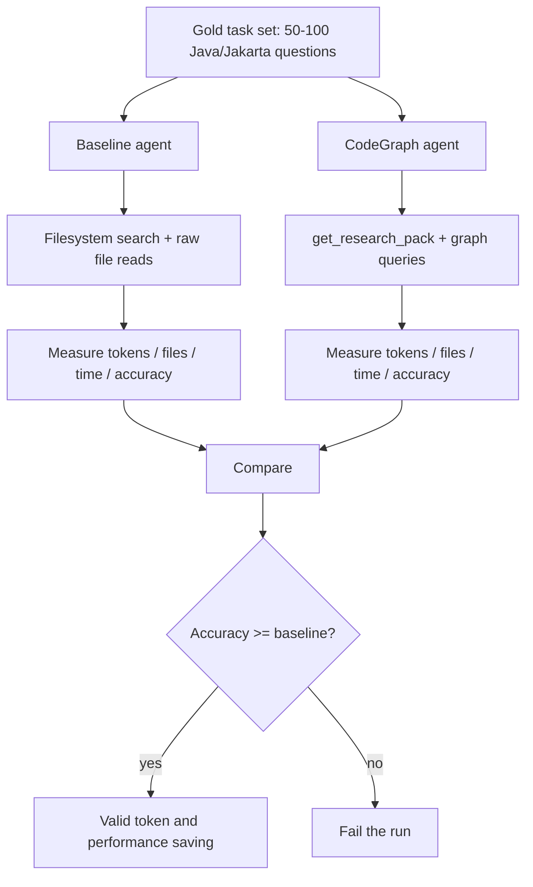

# codegraph

CodeGraph v2 MCP proxy and persistent semantic indexer for GitHub Copilot/Codex agents.

The runtime is v2-only: `node dist/cli.js mcp --root <workspace>` starts an MCP stdio proxy, auto-starts a local daemon, and uses a global SQLite cache for incremental indexing across repos, worktrees, and clones.

Java/Jakarta EE is the primary semantic target. TypeScript/JavaScript and Python parsing remain available through the shared tree-sitter analyzer.

---

## Tools

| Tool | Description |
|------|-------------|
| `explain_endpoint` | Return an endpoint slice: controller, call chain, service/repository/entity/DTO candidates, top files, and likely tests |
| `find_endpoints` | Find Java/Jakarta/Spring endpoint handlers with composed class+method paths and resolution metadata |
| `find_references` | Find definitions, imports, and call references |
| `find_tests_for` | Find tests likely relevant to a symbol using test names, test symbols, and indexed call edges |
| `get_callees` | Find symbols called by a caller symbol |
| `get_callers` | Find call sites that call a symbol |
| `get_context_packet` | Route a natural-language task to a compact packet with candidate files/symbols, line ranges, snippets, tests, validation hints, confidence, omissions, and a next action |
| `get_dependencies` | List direct dependencies for a file/module |
| `get_dependents` | List direct dependents for a file/module |
| `get_file_slice` | Return one bounded source slice by file line range or indexed symbol before editing |
| `get_file_summary` | Summarize symbols, imports, dependencies, and dependents for a file |
| `get_impact_radius` | Estimate blast radius for a target |
| `get_index_stats` | Inspect current snapshot counts and file roles |
| `get_research_pack` | Return a token-budgeted research pack with definitions, callers, callees, impacted endpoints, top files, and confidence notes |
| `impact_of_symbol` | Return an impact slice for a symbol: definitions, callers, callees, affected endpoints, likely tests, and top files |
| `review_patch` | Build a code review packet from files, symbols, or a unified diff: findings, line focus, impact, tests, validation, and reviewer questions |
| `search_code` | Mixed retrieval across files, symbols, endpoints, references, and dependencies |
| `search_files` | Find relevant files with top symbols/endpoints, facets, pagination, and rank evidence |
| `search_symbol` | Search indexed symbols with intent-aware ranking, pagination, facets, and optional rank explanations |
| `simulate_patch_impact` | Simulate impact from changed files, symbols, or a unified diff before editing; returns endpoints, dependents, callers, likely tests, validation, and risk flags |
| `trace_dependencies` | Trace direct/transitive dependencies or dependents with seed files, graph edges, impacted endpoints, and cycle hints |

Graph edges and research packs include confidence notes when resolution is fuzzy or incomplete.

Common retrieval options:

- `explainRank: true` adds a standard `debug` block plus per-result `rankExplanation` where ranking applies.
- `includeSnippets: true` returns short source slices near matched symbols/endpoints; tune with `snippetLines` and `snippetTokenBudget`.
- `autoRefresh: true` refreshes the workspace snapshot before answering; stale snapshots otherwise return `indexFreshness` when the on-disk tree changed.

### Ask your agent these questions

Use prompts like these to make the agent reach for graph tools before opening many files:

- "Use `search_files` first: which files are relevant to creating a notebook?"
- "Use `search_code` with `explainRank: true`: find files, symbols, endpoints, references, and dependencies for payment flow."
- "Use `get_context_packet` for 'fix duplicate refund timeout in payment service' with tokenBudget 4000, then call `get_file_slice` for the top candidate before editing."
- "Use `trace_dependencies`: if I change `UserEntity`, what files and endpoints are affected?"
- "Use `find_tests_for`: which tests are likely relevant for `NotebookController.createNotebook`?"
- "Use `explain_endpoint` with snippets: explain `GET /notebooks` from controller to service/repository/DTO/tests."
- "Use `impact_of_symbol`: who calls `RecallService`, what does it call, and which tests should I run?"
- "Use `simulate_patch_impact` before editing `OrderService.java`: which endpoints, callers, dependents, and tests are likely affected?"
- "Use `review_patch` on this diff with focus `api-contract`: what should block review, what lines need exact slices, and what tests should run?"

### Patch Impact Simulator

`simulate_patch_impact` is the pre-edit/PR-review tool. It accepts any mix of `files`, `symbols`, and a unified `diff`, resolves them against the current snapshot, then returns a compact impact packet:

- changed files and symbols declared in those files
- direct dependencies and dependents
- callers and callees for touched symbols
- endpoints changed directly or exposed by impacted files
- likely tests and inferred validation commands
- risk flags such as `endpoint-change`, `dependent-endpoint`, `high-fanout`, `config-change`, `no-tests-found`, and `unresolved-inputs`

Example MCP arguments:

```json
{
  "files": ["src/main/java/com/example/orders/OrderService.java"],
  "symbols": ["OrderService.createOrder"],
  "diff": "diff --git a/src/main/java/com/example/orders/OrderService.java b/src/main/java/com/example/orders/OrderService.java\n+++ b/src/main/java/com/example/orders/OrderService.java",
  "limit": 50,
  "autoRefresh": true
}
```

Use this before loading large files. The intended agent flow is `simulate_patch_impact` -> `get_file_slice` for the top changed/impacted file -> targeted validation from the simulator response.

### Code Review Packet

`review_patch` builds on `simulate_patch_impact` and adds review-specific evidence:

- `reviewFindings`: deterministic risk hypotheses with `P0`/`P1`/`P2`, not unsupported claims.
- `lineFocus`: changed hunks, line ranges, added/removed previews, and change kinds such as `endpoint`, `contract`, `security`, `debug-output`, or `test`.
- `reviewFocus`: what the reviewer should inspect first: behavior impact, API contract, tests, or security.
- `requiredToolCalls`: exact follow-up graph/slice calls an agent should make before writing final review comments.
- `reviewerQuestions`: concise questions to ask when evidence is incomplete.
- `includeLikelyTests: true`: optional slower deep test lookup. The default review path stays fast and raises a validation gap when tests are not inferred.

Example MCP arguments:

```json
{
  "files": ["src/main/java/com/example/orders/OrderController.java"],
  "symbols": ["OrderController.create"],
  "diff": "diff --git a/src/main/java/com/example/orders/OrderController.java b/src/main/java/com/example/orders/OrderController.java\n--- a/src/main/java/com/example/orders/OrderController.java\n+++ b/src/main/java/com/example/orders/OrderController.java\n@@ -20,6 +20,7 @@\n+        System.out.println(\"debug create order\");",
  "focus": "api-contract",
  "includeLikelyTests": true,
  "limit": 50,
  "autoRefresh": true
}
```

The intended review flow is `review_patch` -> run the listed `requiredToolCalls` -> write final review comments only for issues confirmed by exact slices or tests.

### Large Diff Review Strategy

For real PRs in the 2k-170k changed-line range, do not ask the AI to review the whole diff linearly. Use `review_patch` as a triage router first, then expand only the riskiest areas.

Default `review_patch` output is now `outputMode: "compact"`:

- `reviewStatus`: `blocked`, `needs-attention`, or `ready-for-review`.
- `reviewPlan`: ordered review workflow for large diffs.
- `diffStats`: file count, hunk count, added/removed/changed lines, and scale.
- `reviewFindings`: capped top P0/P1/P2 hypotheses.
- `lineFocus`: ranked risky hunks, not every hunk.
- `lineMappingConfidence`: tells whether exact file line comments are safe.
- `requiredToolCalls`: the next bounded graph/slice calls; no broad scan by default.
- `metrics.omitted*`: how much evidence was intentionally capped.

Use these modes:

| Mode | Use when | Behavior |
|------|----------|----------|
| `compact` | Default for Copilot/Codex review, especially large PRs | Small verdict-first packet, top findings only |
| `balanced` | Need a little more evidence after triage | More hunks/findings/evidence, still capped |
| `full` | Local debugging or benchmark only | Expanded evidence; can be too large for agent context |

Example for a huge PR:

```json
{
  "diff": "<unified diff>",
  "focus": "bug-risk",
  "outputMode": "compact",
  "maxFindings": 8,
  "maxLineFocus": 15,
  "maxEvidencePerFinding": 3,
  "maxRequiredToolCalls": 3
}
```

Review loop for large diffs:

1. Run `review_patch` with `outputMode: "compact"`.
2. Read only `reviewStatus`, `reviewPlan`, P0/P1 findings, and `requiredToolCalls`.
3. Execute required tool calls. If `lineMappingConfidence` is `low`, use `get_file_summary` or symbol lookup before exact line comments.
4. Write final review comments only for confirmed P0/P1 issues; report missing targeted tests as a separate finding.
5. If the compact packet shows many omitted findings/hunks, rerun with `outputMode: "balanced"` for one subsystem or file group, not the whole PR.

Local measurement after compacting `review_patch`, run on 2026-05-24 with the same synthetic review diffs:

| Repo | Compact packet | Full packet | Compact reduction | Next tool behavior |
|------|---------------:|------------:|------------------:|--------------------|
| `doughnut` | 11.7KB | 21.4KB | 45.5% smaller | one bounded `get_file_slice` |
| `hadoop` | 4.4KB | 4.4KB | n/a for tiny diff | `get_file_summary` because diff context did not match the real file |
| `elasticsearch` | 4.2KB | 4.2KB | n/a for tiny diff | `get_file_summary` because diff context did not match the real file |

---

## Quick Start

New to this tool or setting up a fresh machine? Follow this Quick Start from top to bottom before configuring your editor.

### Prerequisites

- **Node.js 20+** — check with `node --version`
- **npm** — bundled with Node.js

### 1. Install & Build

```bash
git clone <repo>
cd code-graph
npm install
npm run build
```

### 2. Run CodeGraph

Prewarm a workspace into the persistent index:

```bash
node dist/cli.js index --root /path/to/your/project
```

Run the MCP stdio proxy:

```bash
node dist/cli.js mcp --root /path/to/your/project
```

This starts an MCP stdio proxy, auto-starts the local daemon, and registers the `--root` workspace in the persistent SQLite index.

Inspect local daemon/cache health:

```bash
node dist/cli.js doctor
```

### Windows Multi-Repo Smoke Test

Use quotes around Windows paths. Test with `index` first; `mcp` is an MCP stdio process and normally waits for an editor/client instead of printing a success message.

```powershell
cd C:\path\to\code-graph
npm install
npm run build

# Optional isolated cache for testing. Omit --home for normal daily use.
$cgHome = Join-Path $env:TEMP "codegraph-smoke-home"
Remove-Item -LiteralPath $cgHome -Recurse -Force -ErrorAction SilentlyContinue

node .\dist\cli.js doctor --home $cgHome

node .\dist\cli.js index `
  --root "C:\path\to\project-a" `
  --home $cgHome

node .\dist\cli.js index `
  --root "C:\path\to\project-b" `
  --home $cgHome
```

Run the same `index` commands again to verify warm-cache behavior. A warm run should show `filesParsed` near `0` and `parseCacheHits` near `filesTotal`.

### Verify That The MCP Is Being Used

The most reliable signal is the CodeGraph daemon log. If an agent actually calls a CodeGraph MCP tool, the log will contain `event: "query"` and a `toolName` such as `get_research_pack`, `search_symbol`, or `get_index_stats`.

```powershell
cd C:\path\to\code-graph

node .\dist\cli.js doctor
node .\dist\cli.js logs --tail 20
```

To watch the log live in PowerShell:

```powershell
$info = node .\dist\cli.js doctor | ConvertFrom-Json
Get-Content -LiteralPath $info.daemonLogPath -Tail 20 -Wait
```

Then ask the agent a direct MCP-only check:

```text
Use codegraph MCP tool get_index_stats and tell me the indexed file count.
```

or:

```text
Use codegraph MCP get_research_pack for PaymentService with tokenBudget 2000. Do not use shell search first.
```

Expected log line:

```json
{"event":"query","toolName":"get_research_pack","args":{"target":"PaymentService","tokenBudget":2000},"durationMs":5,"responseChars":2588}
```

If the UI only shows shell commands, file reads, or text search and the CodeGraph log has no `query` event, the agent did not use CodeGraph for that step.

---

## Integrate with VS Code / GitHub Copilot

Add to your project's `.vscode/settings.json`:

```jsonc
{
  "mcp": {
    "servers": {
      "code-graph": {
        "type": "stdio",
        "command": "node",
        "args": [
          "/absolute/path/to/code-graph/dist/cli.js",
          "mcp",
          "--root",
          "${workspaceFolder}"
        ]
      }
    }
  }
}
```

> Replace `/absolute/path/to/code-graph` with the actual path where you cloned this repo. On Windows, forward slashes are OK, for example `C:/path/to/code-graph/dist/cli.js`.

If VS Code logs `Cannot find module`, the configured path is stale or points at a different clone. Verify that the configured file exists:

```jsonc
"C:/path/to/code-graph/dist/cli.js"
```

Use `${workspaceFolder}` for `--root` when possible. Then each VS Code/Copilot window automatically indexes the folder opened in that window:

```jsonc
{
  "mcp": {
    "servers": {
      "code-graph": {
        "type": "stdio",
        "command": "node",
        "args": [
          "C:/path/to/code-graph/dist/cli.js",
          "mcp",
          "--root",
          "${workspaceFolder}"
        ]
      }
    }
  }
}
```

For a hard-coded project root, use a dedicated server name:

```jsonc
{
  "mcp": {
    "servers": {
      "code-graph-project-a": {
        "type": "stdio",
        "command": "node",
        "args": [
          "C:/path/to/code-graph/dist/cli.js",
          "mcp",
          "--root",
          "C:/path/to/project-a"
        ]
      }
    }
  }
}
```

Avoid pointing VS Code at an old clone or stale compiled entrypoint. The supported entrypoint is `dist/cli.js`.

---

## Multi-window and multi-branch usage

v2 uses one local daemon with a global SQLite cache, while each MCP stdio proxy is scoped to the `--root` passed by the editor window. You do not need one daemon per repo or branch. You only need to make sure each editor/agent window starts CodeGraph with the correct workspace root.

Keep these paths mentally separate:

| Path | Meaning | Example |
|------|---------|---------|
| CodeGraph install | This tool's repo | `C:/path/to/code-graph` |
| Workspace root | The project or branch the agent should inspect | `C:/path/to/project-a` |
| CodeGraph cache | Shared SQLite/cache/daemon state | Managed by CodeGraph, shown by `doctor` |

| Scenario | Recommended v2 setup |
|----------|----------------------|
| One repo/window | Use `dist/cli.js mcp --root "${workspaceFolder}"`. |
| Many different repos | Open each repo in its own window using the same MCP config with `${workspaceFolder}`. Each window registers a different root with the daemon. |
| Same branch/many windows | Multiple windows can point at the same root. They share the daemon and persistent warm cache. |
| Multiple branches at the same time | Use separate `git worktree` directories or separate clones. Each branch must have a different filesystem root. |
| Docker/WSL/shared access | Prefer stdio by launching `dist/cli.js mcp --root /workspace` inside the target environment. |

### Multiple Projects

Example folder layout:

```text
C:/path/to/code-graph
C:/path/to/project-a
C:/path/to/project-b
C:/path/to/project-c
```

Build CodeGraph once:

```powershell
cd "C:\path\to\code-graph"
npm install
npm run build
```

Optional but useful: prewarm each project index once:

```powershell
node .\dist\cli.js index --root "C:\path\to\project-a"
node .\dist\cli.js index --root "C:\path\to\project-b"
node .\dist\cli.js index --root "C:\path\to\project-c"
```

Recommended VS Code setup: put the same `.vscode/settings.json` in each project and use `${workspaceFolder}`:

```jsonc
{
  "mcp": {
    "servers": {
      "code-graph": {
        "type": "stdio",
        "command": "node",
        "args": [
          "C:/path/to/code-graph/dist/cli.js",
          "mcp",
          "--root",
          "${workspaceFolder}"
        ]
      }
    }
  }
}
```

Then open each project in its own VS Code window:

```powershell
code "C:\path\to\project-a"
code "C:\path\to\project-b"
code "C:\path\to\project-c"
```

Each window starts its own stdio MCP proxy, but they share the same daemon/cache. The root is different because `${workspaceFolder}` expands to the folder opened in that window.

### One Project, Multiple Branches

If you need two branches open at the same time, do not keep switching branches in one folder. Use `git worktree` so each branch has its own directory.

Start from your normal repo:

```powershell
cd "C:\path\to\your-repo"
git fetch
```

Create one folder for `main` and one folder for your feature branch:

```powershell
git worktree add "..\your-repo-main" main
git worktree add "..\your-repo-feature-search" feature/search
```

Now you have separate roots:

```text
C:/path/to/your-repo-main
C:/path/to/your-repo-feature-search
```

Prewarm both:

```powershell
cd "C:\path\to\code-graph"
node .\dist\cli.js index --root "C:\path\to\your-repo-main"
node .\dist\cli.js index --root "C:\path\to\your-repo-feature-search"
```

Open each branch folder in a separate editor window:

```powershell
code "C:\path\to\your-repo-main"
code "C:\path\to\your-repo-feature-search"
```

Use the same `${workspaceFolder}` MCP config in both worktree folders. This avoids stale or cross-branch answers because each branch has a different filesystem root.

### Hard-Coded Roots

Use `${workspaceFolder}` when possible. Hard-code roots only when you intentionally want a named MCP server for a specific project/branch.

Example with two hard-coded projects:

```jsonc
{
  "mcp": {
    "servers": {
      "code-graph-project-a": {
        "type": "stdio",
        "command": "node",
        "args": [
          "C:/path/to/code-graph/dist/cli.js",
          "mcp",
          "--root",
          "C:/path/to/project-a"
        ]
      },
      "code-graph-project-b": {
        "type": "stdio",
        "command": "node",
        "args": [
          "C:/path/to/code-graph/dist/cli.js",
          "mcp",
          "--root",
          "C:/path/to/project-b"
        ]
      }
    }
  }
}
```

Example with two branches:

```jsonc
{
  "mcp": {
    "servers": {
      "code-graph-repo-main": {
        "type": "stdio",
        "command": "node",
        "args": [
          "C:/path/to/code-graph/dist/cli.js",
          "mcp",
          "--root",
          "C:/path/to/your-repo-main"
        ]
      },
      "code-graph-repo-feature": {
        "type": "stdio",
        "command": "node",
        "args": [
          "C:/path/to/code-graph/dist/cli.js",
          "mcp",
          "--root",
          "C:/path/to/your-repo-feature-search"
        ]
      }
    }
  }
}
```

### Codex CLI Multi-Project Config

If you use Codex CLI outside VS Code, add one MCP server per project/branch to your Codex config, usually:

```text
C:/Users/<your-user>/.codex/config.toml
```

Example:

```toml
[mcp_servers.code_graph_project_a]
command = "node"
args = [
  "C:/path/to/code-graph/dist/cli.js",
  "mcp",
  "--root",
  "C:/path/to/project-a"
]

[mcp_servers.code_graph_project_b]
command = "node"
args = [
  "C:/path/to/code-graph/dist/cli.js",
  "mcp",
  "--root",
  "C:/path/to/project-b"
]
```

For multi-branch worktrees:

```toml
[mcp_servers.code_graph_repo_main]
command = "node"
args = [
  "C:/path/to/code-graph/dist/cli.js",
  "mcp",
  "--root",
  "C:/path/to/your-repo-main"
]

[mcp_servers.code_graph_repo_feature]
command = "node"
args = [
  "C:/path/to/code-graph/dist/cli.js",
  "mcp",
  "--root",
  "C:/path/to/your-repo-feature-search"
]
```

Restart Codex CLI after changing the config.

### Verify The Active Root

Ask the agent a direct MCP-only check:

```text
Use codegraph MCP tool get_index_stats and tell me the indexed file count.
```

Then check the daemon log:

```powershell
cd "C:\path\to\code-graph"
node .\dist\cli.js logs --tail 50
```

If you see `"event":"query"`, the agent called CodeGraph. If answers look like the wrong project or branch, check:

- Which folder is open in VS Code.
- Whether `.vscode/settings.json` uses `${workspaceFolder}` or a hard-coded `--root`.
- Whether the hard-coded `--root` points at the intended worktree folder.
- Whether you restarted VS Code/Codex after changing MCP config.

Quick checklist:

- Multiple projects: open each project in a separate window, preferably with `${workspaceFolder}`.
- Multiple branches at the same time: use `git worktree` or separate clones.
- Do not use the same filesystem folder for two branches open at once.
- Use a different hard-coded server name per project/branch when not using `${workspaceFolder}`.
- Run `index --root <path>` once per project/branch to prewarm the cache.

Each editor window normally starts its own stdio proxy, so you usually do not run `mcp` manually. The important part is that each project/branch passes the correct `--root`.

---

## Performance model

- SQLite is the source of truth; the daemon does not load the full graph object model into memory.
- Cold indexing scans the manifest, classifies `file_role`, hashes files, parses cache misses, and materializes symbols/imports/calls/endpoints into SQLite.
- Warm indexing reuses previous `blob_hash` values when `mtime_ms` and `size` match, reuses `parse_cache` entries keyed by `blob_hash`, and skips rebuilding a new snapshot when the manifest, HEAD, and dirty state are unchanged.
- Cold or cache-miss parsing can fan out across worker threads after build; small updates use an in-place incremental path that reparses changed files, removes deleted file rows, and rebuilds dependency/call graph rows for affected files instead of copying and resolving the whole snapshot.
- Multiple windows/repositories share the same daemon and global cache, but each `--root` has its own workspace snapshot.
- Search is fastest and most accurate when agents use graph tools first, especially `get_research_pack`, then fall back to broad text search only for unresolved names.
- On very large repositories, Docker Desktop bind mounts from Windows paths are usually slower than local NTFS or WSL/ext4. Prewarm large repos from the same environment where the MCP server will run, and prefer persistent `CODEGRAPH_HOME`/Docker volumes so warm runs can reuse hashes and snapshots.

Index optimization benchmark, run on 2026-05-24 against a synthetic Java repo with 5,000 source files plus 11 build/config files. "Before" is commit `8b8e29e`; "after" is the worker-parse and changed-file incremental index path.

| Case | Before wall | After wall | Wall change | Before index | After index | Index change | After mode |
|------|------------:|-----------:|------------:|-------------:|------------:|-------------:|------------|
| Cold index | 17,913ms | 10,164ms | 43.3% faster | 14,709ms | 9,276ms | 36.9% faster | 4 parse workers |
| Warm unchanged | 1,313ms | 1,354ms | 3.1% slower | 558ms | 588ms | 5.4% slower | skipped unchanged |
| Modify 1 file | 2,437ms | 1,542ms | 36.7% faster | 1,697ms | 706ms | 58.4% faster | incremental |
| Delete 1 file | 2,566ms | 1,802ms | 29.8% faster | 1,783ms | 713ms | 60.0% faster | incremental |

Real-project index benchmark, run on 2026-05-24 against local checkouts under `D:\Personal\Projects`. "Before" is commit `8b8e29e`; "after" is the worker-parse and changed-file incremental index path. The modify case appends and then restores one tracked source file byte-for-byte.

| Repo | Case | Before wall | After wall | Wall change | Before index | After index | Index change | After mode |
|------|------|------------:|-----------:|------------:|-------------:|------------:|-------------:|------------|
| `doughnut` | Cold index | 20.6s | 12.8s | 37.8% faster | 17.9s | 12.0s | 33.0% faster | 4 parse workers |
| `doughnut` | Warm unchanged | 1.1s | 1.1s | 0.3% faster | 0.3s | 0.3s | 7.7% slower | skipped unchanged |
| `doughnut` | Modify 1 file | 3.0s | 1.4s | 53.6% faster | 2.2s | 0.5s | 77.8% faster | incremental |
| `hadoop` | Cold index | 485.6s | 342.6s | 29.4% faster | 393.8s | 341.1s | 13.4% faster | 4 parse workers |
| `hadoop` | Warm unchanged | 2.4s | 2.4s | 1.5% slower | 1.6s | 1.6s | 3.9% slower | skipped unchanged |
| `hadoop` | Modify 1 file | 58.7s | 10.8s | 81.6% faster | 57.8s | 9.9s | 83.0% faster | incremental |
| `elasticsearch` | Cold index | 1,314.6s | 663.1s | 49.6% faster | 1,024.0s | 660.9s | 35.5% faster | 4 parse workers |
| `elasticsearch` | Warm unchanged | 19.8s | 9.6s | 51.7% faster | 17.7s | 7.5s | 57.9% faster | skipped unchanged |
| `elasticsearch` | Modify 1 file | 404.0s | 22.2s | 94.5% faster | 403.3s | 20.8s | 94.8% faster | incremental |

Review-packet proof benchmark, run on 2026-05-24 against warmed indexes for the same local checkouts. It compares baseline raw file reads/search against one `review_patch` packet per task. Token counts use the documented `ceil(character_count / 4)` estimator, not actual model API usage.

| Repo | Tasks | Baseline correct | Review packet correct | Input token change | Output token change | File-open change | `review_patch` p95 |
|------|------:|-----------------:|----------------------:|-------------------:|--------------------:|-----------------:|-------------------:|
| `doughnut` | 3 | 3/3 | 3/3 | 78.8% fewer | 51.2% fewer | 80.0% fewer | 688ms |
| `hadoop` | 1 | 0/1 | 1/1 | 97.5% fewer | 50.2% fewer | 98.3% fewer | 5,364ms |
| `elasticsearch` | 1 | 1/1 | 1/1 | 93.9% fewer | 68.0% fewer | 93.3% fewer | 9,285ms |

The Hadoop baseline missed the expected file within its capped raw-file scan, while the review packet resolved it from the index. Large-repo review latency is still higher than ideal, but it stays bounded to one graph packet instead of dozens of raw file reads.

Real GitHub Copilot CLI A/B review proof, run on 2026-05-24 with `gh copilot --output-format=json`. The same technical-review prompt and synthetic debug-print diff were used for both modes. Exact model input tokens were not exposed in the Copilot JSONL on this machine (`actualInputTokens: null`), so this table reports actual assistant `outputTokens`, wall time, and tool behavior from the captured JSONL.

| Repo | Baseline time | CodeGraph time | Time change | Baseline output tokens | CodeGraph output tokens | Output token change | CodeGraph tools used | Raw-file mention change |
|------|--------------:|---------------:|------------:|-----------------------:|------------------------:|--------------------:|----------------------|------------------------:|
| `doughnut` | 29.3s | 52.8s | 80.4% slower | 880 | 1,592 | 80.9% more | `review_patch`, `get_file_slice` | 62 more |
| `hadoop` | 33.3s | 65.0s | 95.2% slower | 1,043 | 2,679 | 156.9% more | `review_patch`, `get_file_slice` | 57 more |
| `elasticsearch` | 34.9s | 42.2s | 20.9% slower | 1,106 | 1,251 | 13.1% more | `review_patch`, `get_file_slice` | 22 fewer |

The Copilot CLI proof did not validate a token/time win yet. It validated that the MCP can connect and be called in real Copilot sessions, but the current `review_patch` output is too large/noisy for agent review. The main failure modes observed:

- `review_patch` can return a large packet, especially for controller files with many endpoints; Copilot then spends extra turns reading the packet or its temp-file spill.
- `requiredToolCalls` used diff hunk line numbers as if they were real file line numbers. For synthetic diffs against large real files, `get_file_slice` returned license/header lines instead of the changed code, so Copilot fell back to normal `view`.
- Workspace identity must be stable. The Copilot runner needs the same `-WorkspaceKey` used during prewarm; otherwise MCP starts against an unindexed workspace and falls back to raw search.

Workspace-key prewarm setup cost for the same proof run:

| Repo | Files | Files parsed | Parse cache hits | Key-snapshot build time | Note |
|------|------:|-------------:|-----------------:|------------------------:|------|
| `doughnut` | existing | existing | existing | already warm | Keyed snapshot already existed |
| `hadoop` | 13,356 | 0 | 13,356 | 79.7s | Snapshot rebuild from parse cache |
| `elasticsearch` | 27,015 | 0 | 24,891 | 235.0s | Snapshot rebuild from parse cache, observed RSS around 2.6GB |

Next review-quality optimization target: make `review_patch` return a compact verdict-first packet with real-file line mapping, capped endpoint evidence, and only one or two high-confidence required follow-up calls. Until that is fixed, the local benchmark `benchmark review` proves retrieval compression, while real Copilot CLI review does not yet prove lower token/time consumption.

---

## Docker

Docker is optional. v2 normally runs best as a local stdio command from VS Code/Codex, but the image can be used when the workspace must be mounted into a container.

For a detailed Docker operations guide covering image builds, prewarming indexes, branch checkouts, worktrees, cache resets, and performance modes, see [`docs/docker-setup.md`](docs/docker-setup.md).

### Docker setup runbook

Use this checklist when setting up Docker for one or more real repositories.

1. Build the image from the CodeGraph repo:

```powershell
cd D:\Personal\Projects\code-graph
docker --context desktop-linux build -t mcp-code-graph:latest .
```

If your Docker context is already the Docker Desktop Linux engine, plain `docker build -t mcp-code-graph:latest .` is enough. On Windows, `docker --context desktop-linux ...` avoids accidentally targeting a stopped/default context.

2. Create one persistent cache volume. Reuse this volume across runs so warm index data survives container exit:

```powershell
docker --context desktop-linux volume create codegraph-cache
```

3. Prewarm a project index before wiring the MCP into an editor:

```powershell
docker --context desktop-linux run --rm `
  -v "D:/Personal/Projects/doughnut:/workspace:ro" `
  -v "codegraph-cache:/codegraph-home" `
  -e "CODEGRAPH_WORKSPACE_KEY=D:/Personal/Projects/doughnut" `
  mcp-code-graph:latest `
  index --root /workspace
```

Run the same command again to confirm warm behavior. A healthy warm run should report `skippedUnchanged: true` or `filesParsed: 0`, plus high `hashCacheHits`/`parseCacheHits`.

4. Run the MCP stdio process manually as a smoke test:

```powershell
docker --context desktop-linux run --rm -i `
  -v "D:/Personal/Projects/doughnut:/workspace:ro" `
  -v "codegraph-cache:/codegraph-home" `
  -e "CODEGRAPH_WORKSPACE_KEY=D:/Personal/Projects/doughnut" `
  mcp-code-graph:latest `
  mcp --root /workspace --auto-refresh
```

This command is expected to keep running because it is an MCP stdio server. Stop it with `Ctrl+C` after confirming the container starts without errors.

5. Use a different `CODEGRAPH_WORKSPACE_KEY` for every host project, even though all containers mount the repo at `/workspace`:

```powershell
# Doughnut
-v "D:/Personal/Projects/doughnut:/workspace:ro"
-e "CODEGRAPH_WORKSPACE_KEY=D:/Personal/Projects/doughnut"

# Hadoop
-v "D:/Personal/Projects/hadoop:/workspace:ro"
-e "CODEGRAPH_WORKSPACE_KEY=D:/Personal/Projects/hadoop"

# Elasticsearch
-v "D:/Personal/Projects/elasticsearch:/workspace:ro"
-e "CODEGRAPH_WORKSPACE_KEY=D:/Personal/Projects/elasticsearch"
```

Without a stable workspace key, multiple repos can collide because Docker presents each one as `/workspace`.

6. Inspect the Docker cache if warm runs look wrong:

```powershell
docker --context desktop-linux run --rm `
  -v "codegraph-cache:/codegraph-home" `
  --entrypoint sh `
  mcp-code-graph:latest `
  -lc "ls -lh /codegraph-home && du -sh /codegraph-home"
```

7. Reset Docker cache only when you intentionally want a cold run:

```powershell
docker --context desktop-linux volume rm codegraph-cache
docker --context desktop-linux volume create codegraph-cache
```

8. Benchmark Docker retrieval with a warmed index:

```powershell
docker --context desktop-linux run --rm `
  -v "D:/Personal/Projects/doughnut:/workspace:ro" `
  -v "codegraph-cache:/codegraph-home" `
  -e "CODEGRAPH_WORKSPACE_KEY=D:/Personal/Projects/doughnut" `
  mcp-code-graph:latest `
  benchmark proof --root /workspace --tasks auto --task-count 3 --no-index
```

Use `--no-index` only after a successful prewarm. It measures retrieval/context routing without refreshing the snapshot first.

For code-review effectiveness specifically, run:

```powershell
docker --context desktop-linux run --rm `
  -v "D:/Personal/Projects/doughnut:/workspace:ro" `
  -v "codegraph-cache:/codegraph-home" `
  -e "CODEGRAPH_WORKSPACE_KEY=D:/Personal/Projects/doughnut" `
  mcp-code-graph:latest `
  benchmark review --root /workspace --tasks auto --task-count 3 --no-index
```

`benchmark review` compares baseline raw file reads against one `review_patch` packet per task and reports input/output token savings, file-open reduction, correctness, and `reviewPatchP95Ms`.

### Docker troubleshooting

| Symptom | Likely cause | Fix |
|---------|--------------|-----|
| `Cannot connect to the Docker daemon` | Docker Desktop engine/context is not running | Start Docker Desktop, then try `docker --context desktop-linux ps` |
| Every repo appears as the same workspace | Missing or reused `CODEGRAPH_WORKSPACE_KEY` | Set a unique host path or stable key per repo |
| Warm run still parses everything | Cache volume changed or workspace key changed | Reuse the same volume and exact workspace key |
| Very slow cold index on Windows | Docker Desktop bind mount overhead | Prefer local Node/stdio or WSL/ext4 for large repos; keep Docker cache volume persistent |
| Corporate `npm ci` fails during build with `UNABLE_TO_GET_ISSUER_CERT_LOCALLY` | Missing trusted root CA inside the Docker build container | Use `.\docker-build.ps1 -CaCert C:\path\corp-root-ca.crt`; see [`docs/docker-setup.md`](docs/docker-setup.md#unable_to_get_issuer_cert_locally-during-docker-build) |
| `better-sqlite3`/`node-gyp` tries to download headers from `unofficial-builds.nodejs.org` | Alpine native addon build is trying to fetch Node headers over corporate TLS | Use the latest Dockerfile, which sets npm/node-gyp `nodedir=/usr/local` and builds native addons from source against local headers |
| Runtime stage recompiles native addons | Runtime ran `npm ci --omit=dev` after builder already compiled dependencies | Use the latest Dockerfile, which prunes dev deps in builder and copies production `node_modules` into runtime |
| MCP starts but agent does not use it | Editor config points to wrong command/args | Check CodeGraph logs or ask the agent to call `get_index_stats` explicitly |

Windows PowerShell:

```powershell
# Build only
.\docker-build.ps1

# Build + run the MCP stdio proxy against one project
.\docker-build.ps1 -Run -ProjectPath D:\Personal\Projects\mall

# Build + export to tar.gz
.\docker-build.ps1 -Export -Out D:\transfer\mcp-code-graph.tar.gz

# Build with a corporate/internal root CA certificate
.\docker-build.ps1 -CaCert C:\temp\corp-root-ca.crt
```

WSL, Linux, or macOS:

```bash
# Build only
./docker-build.sh

# Build with a corporate/internal root CA certificate
./docker-build.sh --ca-cert /path/to/corp-root-ca.crt

# Build + export to tar.gz (for transfer to WSL / another machine)
./docker-build.sh --export

# Build + run the MCP stdio proxy against a project
./docker-build.sh --run /path/to/your/project
```

Run manually:

```bash
docker build -t mcp-code-graph .

docker run --rm -i \
  -v "/absolute/path/to/project:/workspace:ro" \
  -v codegraph-cache:/codegraph-home \
  -e CODEGRAPH_WORKSPACE_KEY="/absolute/path/to/project" \
  mcp-code-graph \
  mcp --root /workspace --auto-refresh
```

When Docker sees every project as `/workspace`, set `CODEGRAPH_WORKSPACE_KEY` to the host project path or another stable unique key. This prevents multiple repositories from sharing the same workspace identity in a persistent Docker cache. Use `--auto-refresh` if you change branches with `git checkout` in the same folder; CodeGraph will refresh only when the snapshot is stale.

If your machine or company network requires a custom trusted root certificate for `npm ci`, export the certificate as PEM/CRT and pass it at build time:

```powershell
# Windows example: export a trusted root certificate by thumbprint, then PEM-encode it
$cert = Get-ChildItem Cert:\CurrentUser\Root | Where-Object Thumbprint -eq "<THUMBPRINT>"
Export-Certificate -Cert $cert -FilePath C:\temp\corp-root-ca.cer | Out-Null
certutil -encode C:\temp\corp-root-ca.cer C:\temp\corp-root-ca.crt
```

```bash
DOCKER_BUILDKIT=1 ./docker-build.sh --ca-cert /mnt/c/temp/corp-root-ca.crt
```

VS Code MCP config using Docker:

```jsonc
{
  "mcp": {
    "servers": {
      "code-graph": {
        "type": "stdio",
        "command": "docker",
        "args": [
          "run",
          "--rm",
          "-i",
          "-v",
          "${workspaceFolder}:/workspace:ro",
          "-v",
          "codegraph-cache:/codegraph-home",
          "-e",
          "CODEGRAPH_WORKSPACE_KEY=${workspaceFolder}",
          "mcp-code-graph:latest",
          "mcp",
          "--root",
          "/workspace",
          "--auto-refresh"
        ]
      }
    }
  }
}
```

Codex CLI config using Docker:

```toml
# C:/Users/<your-user>/.codex/config.toml
[mcp_servers.code_graph_mall]
command = "docker"
args = [
  "run",
  "--rm",
  "-i",
  "-v",
  "D:/Personal/Projects/mall:/workspace:ro",
  "-v",
  "codegraph-cache:/codegraph-home",
  "-e",
  "CODEGRAPH_WORKSPACE_KEY=D:/Personal/Projects/mall",
  "mcp-code-graph:latest",
  "mcp",
  "--root",
  "/workspace",
  "--auto-refresh"
]
```

For multiple projects, keep one MCP server entry per project or use the VS Code `${workspaceFolder}` config above. The container should keep the source mount read-only and store CodeGraph's SQLite cache in `codegraph-cache`.

Multi-project examples:

- VS Code/Copilot: [`examples/vscode-docker-mcp.settings.jsonc`](examples/vscode-docker-mcp.settings.jsonc)
- Codex CLI: [`examples/docker-multi-project.codex.toml.example`](examples/docker-multi-project.codex.toml.example)

For Docker, `/workspace` is the path inside every container. The important isolation key is `CODEGRAPH_WORKSPACE_KEY`; set it to the host project path or another stable unique value for each project/branch.

Recent Windows Docker multi-project smoke report:

| Project | Workspace ID prefix | Files | Files parsed | Parse cache hits | Wall time |
|---------|---------------------|-------|--------------|------------------|-----------|
| `mall` pass 1 | `df8f73` | 653 | 0 | 653 | 66.3s |
| `mall` pass 2 | `df8f73` | 653 | 0 | 653 | 67.5s |
| `doughnut` cold | `1da416` | 1345 | 1341 | 0 | 169.6s |
| `doughnut` warm | `1da416` | 1345 | 0 | 1345 | 103.5s |

The smoke test used one shared Docker volume, `codegraph-cache`, with separate `CODEGRAPH_WORKSPACE_KEY` values. MCP startup was also verified through Docker for both projects, exposing 19 tools. Docker Desktop bind mounts from `D:\...` are noticeably slower than local or WSL/Linux filesystems; for very large repositories, prewarm from WSL/ext4 when possible.

Recent Docker context-proof report, run on 2026-05-23 with a warmed CodeGraph index:

| Repo | Tasks | Baseline correct | CodeGraph correct | Baseline input tokens | CodeGraph input tokens | Input reduction | Baseline output tokens | CodeGraph output tokens | Baseline files | CodeGraph slices |
|------|------:|-----------------:|------------------:|----------------------:|-----------------------:|----------------:|-----------------------:|------------------------:|---------------:|-----------------:|
| `doughnut` | 3 | 3/3 | 3/3 | 44,012 | 21,270 | 51.7% | 412 | 411 | 25 | 4 |
| `hadoop` | 2 | 1/2 | 2/2 | 397,875 | 16,956 | 95.7% | 443 | 461 | 120 | 4 |
| `elasticsearch` | 2 | 0/2 | 2/2 | 346,710 | 15,939 | 95.4% | 482 | 398 | 120 | 4 |

These token numbers are local estimates using `ceil(character_count / 4)` over the task and retrieved evidence. They are useful for comparing context size, but they are not actual model/API usage. The output-token column is the deterministic benchmark summary size, not real LLM completion tokens.

---

## CLI Reference

```
codegraph mcp --root <workspace>       Run MCP stdio proxy and auto-start daemon
codegraph daemon start|stop|status     Manage local daemon
codegraph daemon run                   Run daemon in the foreground
codegraph index --root <workspace>     Prewarm persistent index
codegraph doctor                       Inspect local configuration
codegraph benchmark generate|index|eval|proof|review
                                      Generate synthetic repos, measure indexing, run evals, or prove context/review savings

Options:
  --root <path>                        Workspace root
  --home <path>                        Override CODEGRAPH_HOME
  --port <number>                      Daemon port for daemon run
  --tasks <path>                       Golden eval task JSON file
  --tasks auto                         Derive proof/review tasks from indexed-looking source files
  --task-count <number>                Number of auto-derived proof/review tasks
  --no-index                           Reuse the current proof/review snapshot instead of refreshing first
  --parse-workers <number>             Worker threads for cold/cache-miss parsing during index
  --no-incremental                     Force changed-file index runs through full snapshot rebuild
  --incremental-file-limit <number>    Max changed/deleted files for incremental index path
  --workspace-key <key>                Stable workspace identity key for Docker/WSL path remapping
  --auto-refresh                       Refresh stale snapshots automatically before MCP tool calls
```

**Examples:**

```bash
# Prewarm a Java/Jakarta project
node dist/cli.js index --root /path/to/project

# Run MCP stdio proxy
node dist/cli.js mcp --root /path/to/project

# Use an isolated cache for benchmark/proof runs
node dist/cli.js benchmark index --root /path/to/project --home /tmp/codegraph-proof-home

# Run golden eval tasks against a project
node dist/cli.js benchmark eval --root /path/to/project --tasks examples/golden-eval-tasks.example.json --home /tmp/codegraph-proof-home

# Compare baseline file reads with get_context_packet + get_file_slice
node dist/cli.js benchmark proof --root /path/to/project --tasks examples/context-proof-tasks.example.json --home /tmp/codegraph-proof-home

# Compare baseline raw review context with review_patch packets
node dist/cli.js benchmark review --root /path/to/project --tasks examples/review-proof-tasks.example.json --home /tmp/codegraph-proof-home
```

---

## Development

```bash
npm run dev -- mcp --root /path/to/project # Run CLI with tsx
npm run build                             # Compile TypeScript → dist/
npm test                                  # Run test suite
npm run test:watch                        # Watch mode
npm run lint                              # Type-check only
```

---

## Enterprise Indexer

CodeGraph uses a local daemon, global SQLite cache, per-workspace snapshots, file-content parse-cache reuse, and a stdio proxy command intended for Copilot/Codex multi-window usage.

```bash
npm run build

# Prewarm a workspace into the persistent SQLite index
node dist/cli.js index --root /path/to/java-enterprise-repo

# Use as the MCP command from VS Code/Codex
node dist/cli.js mcp --root /path/to/java-enterprise-repo

# Inspect daemon/storage health
node dist/cli.js doctor
```

VS Code/Copilot MCP config:

```jsonc
{
  "mcp": {
    "servers": {
      "code-graph": {
        "type": "stdio",
        "command": "node",
        "args": [
          "/absolute/path/to/code-graph/dist/cli.js",
          "mcp",
          "--root",
          "${workspaceFolder}"
        ]
      }
    }
  }
}
```

Storage defaults to `CODEGRAPH_HOME` or the OS user state/cache directory. The daemon manages one logical workspace per root/worktree/clone and reuses parse cache by file content hash across branches and clones.

Benchmark helpers:

```bash
# Generate a synthetic Java/Jakarta repo
node dist/cli.js benchmark generate --root /tmp/synth-java --files 10000 --modules 10

# Measure persistent index performance
node dist/cli.js benchmark index --root /tmp/synth-java

# Compare baseline text retrieval vs CodeGraph on an agent-style task set
node dist/cli.js benchmark eval --root /path/to/project --tasks examples/golden-eval-tasks.example.json
```

The golden eval task file is a JSON array. Start from `examples/golden-eval-tasks.example.json`, replace names like `OrderService` or `/orders` with terms from your project, and keep the same file for every baseline-vs-CodeGraph run.

### v2 Operating Principle

The v2 design optimizes for agent research on large Java/Jakarta repositories. Instead of asking an agent to open many files and infer relationships from raw text, CodeGraph keeps a persistent semantic index and returns a compact, ranked research pack.



The indexer is staged so saves and pulls update only the affected slice of the graph.



Agent queries should prefer `get_research_pack` over broad file reads.



### Proving Token Savings, Performance, and Accuracy

Token savings are only valid when answer quality stays equal or improves. A smaller context that produces worse answers is a failed optimization.



Use the same repository, same task set, same agent, and same time limits for both modes:

| Dimension | Baseline | CodeGraph mode | Success signal |
|-----------|----------|----------------|----------------|
| Context usage | Agent opens/searches files directly | Agent asks graph tools first | 40-70% fewer context tokens |
| File reads | Count opened files and returned lines | Count graph tool calls and returned evidence | 50%+ fewer files opened |
| Performance | Wall time and tool latency | Warm query/research-pack latency | p95 under target thresholds |
| Accuracy | Gold-set correctness | Gold-set correctness | Equal or better than baseline |
| Evidence quality | Raw snippets from many files | Ranked evidence with confidence and provenance | Fewer unsupported claims |

Recommended formula:

```text
token_saving_pct = 1 - (tokens_with_codegraph / tokens_baseline)
```

For exact proof, capture model/API token usage where available. When exact token counts are unavailable, log tool responses and estimate context tokens consistently, for example `ceil(char_count / 4)`, then use the same estimator for both modes.

Minimum evaluation dataset:

```text
1. Who calls PaymentService.charge()?
2. Which endpoints are affected by changing UserEntity.email?
3. What controller/service/entity path handles POST /orders?
4. Which bean implementations can satisfy this interface injection?
5. Which tests are most relevant for this service method?
```

For a useful agent benchmark, keep 20-50 project-specific questions in one JSON file. Each task should name:

- `question`: what the agent needs to answer.
- `codegraphTool` and `codegraphArgs`: the first graph tool call to compare.
- `baselineSearchTerms`: terms used by the baseline scanner to estimate files/tokens opened.
- `expectedContains`: short strings that must appear in the CodeGraph response for a lightweight correctness check.

Run it with:

```bash
node dist/cli.js benchmark eval --root /path/to/project --tasks examples/golden-eval-tasks.example.json --home /tmp/codegraph-proof-home
```

The output includes per-task correctness, estimated tokens, baseline files opened, CodeGraph response size, and aggregate `tokenSavingPct`.

To prove the context-router workflow specifically, use `benchmark proof`. It compares a baseline scanner that opens matched files against CodeGraph calling `get_context_packet` and then `get_file_slice` for the top candidates:

```bash
node dist/cli.js benchmark proof --root /path/to/project --tasks examples/context-proof-tasks.example.json --home /tmp/codegraph-proof-home
```

Each proof task can include:

- `task`: natural-language agent request.
- `domain`: optional module/domain hint.
- `baselineSearchTerms`: terms the baseline scanner uses.
- `expectedContains`: strings that must appear in MCP evidence.
- `expectedFiles`: files that should appear in `topFiles` or sliced files.
- `maxFiles`, `maxSymbols`, `tokenBudget`, `sliceCount`, `includeSnippets`: context-router budget knobs. The proof runner defaults `includeSnippets` to `false`, then fetches exact slices separately with `get_file_slice`.

The proof report includes `baselineCorrect`, `mcpCorrect`, `qualityMaintained`, `tokenSavingPct`, `fileOpenReductionPct`, `contextPacketP95Ms`, and `mcpWorkflowP95Ms`. Treat it as a retrieval proof; full coding proof still needs running the same edit tasks with an agent and validating patches/tests.

To prove code-review workflow specifically, use `benchmark review`. It compares a baseline reviewer that opens matched files against CodeGraph calling `review_patch` once per task:

```bash
node dist/cli.js benchmark review --root /path/to/project --tasks examples/review-proof-tasks.example.json --home /tmp/codegraph-proof-home
```

Each review task can include:

- `title`: review request.
- `files`, `symbols`, and `diff`: the proposed patch inputs for `review_patch`.
- `focus`: `general`, `bug-risk`, `api-contract`, `tests`, or `security`.
- `baselineSearchTerms`: terms the baseline scanner uses.
- `expectedContains` and `expectedFiles`: lightweight correctness checks for the review packet.

The review proof report includes `baselineCorrect`, `mcpCorrect`, `qualityMaintained`, `inputTokenSavingPct`, `outputTokenSavingPct`, `fileOpenReductionPct`, and `reviewPatchP95Ms`.

To prove the same workflow with the real GitHub Copilot CLI, use the A/B runner after `gh auth login` and after `gh copilot -- --help` works:

```powershell
npm.cmd run build
powershell -ExecutionPolicy Bypass -File .\examples\copilot-review-proof.ps1 `
  -RepoRoot D:\Personal\Projects\doughnut `
  -CodeGraphRoot D:\Personal\Projects\code-graph `
  -CodeGraphHome D:\Personal\Projects\code-graph\.tmp-debug-home\proof-home-doughnut `
  -WorkspaceKey D:\Personal\Projects\doughnut
```

Use `-WorkspaceKey` whenever the index was prewarmed with `--workspace-key` or `CODEGRAPH_WORKSPACE_KEY`; the MCP run must use the same key or it will register a new unindexed workspace. Use `-SkipIndex` only after the keyed snapshot already exists. Use `-DiffFile <path>` to review a fixed patch file instead of the current working-tree diff.

The script runs the same technical-review prompt twice:

- baseline: `gh copilot -p ... --disable-mcp-server=codegraph`
- CodeGraph: `gh copilot -p ... --additional-mcp-config=@<temp codegraph mcp config>`

It writes `summary.json`, captured JSONL output, logs, prompt, diff, and MCP config under `.tmp-debug-home/copilot-review-proof-runs/<timestamp>`. The summary reports assistant `outputTokens` when Copilot JSONL exposes `assistant.message.data.outputTokens`. Exact input tokens are often not present; in that case `actualInputTokens` is `null`, and `estimatedTokens` is only a consistent captured-log size estimate (`ceil(captured_chars / 4)`), not true model input usage.

Metrics to report:

| Metric | Target |
|--------|--------|
| Warm query latency p95 | <200ms |
| `get_research_pack` p95 | <2s |
| Single saved Java file update | <1s |
| Pull update with <500 changed files | <30s |
| Java call edge precision | >85% |
| Jakarta endpoint recall | >95% |
| Impact top-5 recall | >90% |
| Agent context token reduction | 40-70% |
| Agent file-open reduction | 50%+ |
| `review_patch` p95 | <2s small/medium repos; <10s very large repos |
| Review input token reduction | 40-70% with correctness maintained |

### Proof Runbook

Use an isolated `CODEGRAPH_HOME` for proof runs so benchmark data does not mix with normal development data.

PowerShell setup:

```powershell
npm install
npm run build

$proofRoot = Join-Path $env:TEMP "codegraph-proof"
$cgHome = Join-Path $env:TEMP "codegraph-proof-home"
Remove-Item -LiteralPath $proofRoot, $cgHome -Recurse -Force -ErrorAction SilentlyContinue
New-Item -ItemType Directory -Force -Path $proofRoot, $cgHome | Out-Null
```

Run synthetic scale benchmarks:

```powershell
foreach ($files in 10000, 30000, 60000) {
  $repo = Join-Path $proofRoot "synth-$files"

  node dist/cli.js benchmark generate `
    --root $repo `
    --files $files `
    --modules ([Math]::Max(1, [int]($files / 1000)))

  $sw = [Diagnostics.Stopwatch]::StartNew()
  $cold = node dist/cli.js benchmark index --root $repo --home $cgHome | ConvertFrom-Json
  $sw.Stop()

  [pscustomobject]@{
    files = $files
    run = "cold"
    wallMs = $sw.ElapsedMilliseconds
    indexTimeMs = $cold.result.indexTimeMs
    manifestScanMs = $cold.result.manifestScanMs
    filesParsed = $cold.result.filesParsed
    parseCacheHits = $cold.result.parseCacheHits
    peakRssMb = $cold.peakRssMb
  } | Format-List

  $sw = [Diagnostics.Stopwatch]::StartNew()
  $warm = node dist/cli.js benchmark index --root $repo --home $cgHome | ConvertFrom-Json
  $sw.Stop()

  [pscustomobject]@{
    files = $files
    run = "warm"
    wallMs = $sw.ElapsedMilliseconds
    indexTimeMs = $warm.result.indexTimeMs
    manifestScanMs = $warm.result.manifestScanMs
    filesParsed = $warm.result.filesParsed
    parseCacheHits = $warm.result.parseCacheHits
    peakRssMb = $warm.peakRssMb
  } | Format-List
}
```

Expected signal:

```text
cold run: filesParsed is high, parseCacheHits is low
warm run: filesParsed should drop sharply, parseCacheHits should be high
peakRssMb should stay below the 2GB target for 60k files
```

Measure a single-file incremental update:

```powershell
$repo = Join-Path $proofRoot "synth-10000"
$file = Get-ChildItem -LiteralPath $repo -Recurse -Filter "Service0_0.java" | Select-Object -First 1
Add-Content -LiteralPath $file.FullName -Value "`n// proof touch"

$sw = [Diagnostics.Stopwatch]::StartNew()
$update = node dist/cli.js benchmark index --root $repo --home $cgHome | ConvertFrom-Json
$sw.Stop()

[pscustomobject]@{
  run = "single-file-update"
  wallMs = $sw.ElapsedMilliseconds
  indexTimeMs = $update.result.indexTimeMs
  filesParsed = $update.result.filesParsed
  parseCacheHits = $update.result.parseCacheHits
  peakRssMb = $update.peakRssMb
} | Format-List
```

Expected signal:

```text
filesParsed should be close to 1
wallMs should trend toward the <1s target on a warmed repo
```

Measure warm query and `get_research_pack` latency:

```powershell
$repo = Join-Path $proofRoot "synth-10000"
node dist/cli.js daemon start --home $cgHome

@'
import { DaemonClient } from "./dist/v2/daemon/client.js";

const [homeDir, root] = process.argv.slice(2);
const info = DaemonClient.readInfo(homeDir);
if (!info) throw new Error("Daemon is not running");

const client = new DaemonClient(info);
const workspace = await client.registerWorkspace(root);
await client.refreshWorkspace(root);

const samples = [];
let responseChars = 0;

for (let i = 0; i < 100; i++) {
  const start = performance.now();
  const result = await client.query(workspace.workspaceId, "get_research_pack", {
    target: "Service0_0",
    taskType: "impact",
    tokenBudget: 4000
  });
  samples.push(performance.now() - start);
  responseChars += JSON.stringify(result).length;
}

samples.sort((a, b) => a - b);
const p50 = samples[Math.floor(samples.length * 0.50)];
const p95 = samples[Math.floor(samples.length * 0.95)];
const avgChars = Math.round(responseChars / samples.length);

console.log(JSON.stringify({
  samples: samples.length,
  p50Ms: Math.round(p50),
  p95Ms: Math.round(p95),
  avgResponseChars: avgChars,
  estimatedResponseTokens: Math.ceil(avgChars / 4)
}, null, 2));
'@ | node --input-type=module - $cgHome $repo

node dist/cli.js daemon stop --home $cgHome
```

Expected signal:

```text
p95Ms should be below 2000ms for get_research_pack
estimatedResponseTokens should stay inside the requested tokenBudget
```

To prove token savings and accuracy with a real agent, run the same gold-set tasks twice:

```text
Run A: disable CodeGraph MCP, allow normal filesystem search/read tools.
Run B: enable CodeGraph MCP, require graph tools first, especially get_research_pack.
```

For each task, record:

```text
task_id
repo
mode: baseline | codegraph
answer_correct: true | false
input_tokens
output_tokens
tool_response_chars
estimated_tool_tokens = ceil(tool_response_chars / 4)
files_opened
elapsed_ms
```

A result only passes if:

```text
correctness_codegraph >= correctness_baseline
tokens_codegraph < tokens_baseline
files_opened_codegraph < files_opened_baseline
```

Example report shape:

```text
Task                    Baseline tokens   CodeGraph tokens   Saving   Correct
Payment callers         42000             9500               77%      yes
POST /orders path       55000             14000              74%      yes
UserEntity impact       80000             22000              72%      yes
```

**Run demo scripts** (requires `npm run build` first):

```bash
node demo.mjs              # Spring Boot sample project
node demo-jakartaee.mjs    # Jakarta EE MVC sample
node demo-ecommerce.mjs    # Jakarta EE Servlet + JPA
```

---

## Supported Languages & Framework Detection

### Java

| Feature | Details |
|---------|---------|
| Symbols | classes, interfaces, enums, records, fields, methods, constructors |
| Imports | full package path resolution |
| Call graph | method calls, method references (`User::getName`) |
| Framework roles | Spring Boot, Jakarta EE, JUnit 5/4, Mockito, Lombok |
| Annotation filters | `search_symbol` accepts `annotation` and `frameworkRole` params |

**Framework roles** detectable via `search_symbol { frameworkRole: "..." }`:

| Role | Annotations |
|------|------------|
| `spring:rest-controller` | `@RestController` |
| `spring:endpoint` | `@GetMapping`, `@PostMapping`, `@PutMapping`, etc. |
| `spring:service` | `@Service` |
| `spring:transactional` | `@Transactional` |
| `mvc:controller` | `@Controller` + `@Path` (Jakarta MVC) |
| `jaxrs:endpoint` | `@GET`, `@POST`, `@PUT`, `@DELETE`, `@PATCH` |
| `jaxrs:provider` | `@Provider` (ExceptionMapper, ParamConverter) |
| `jakarta:entity` | `@Entity` |
| `jakarta:stateless` | `@Stateless` |
| `jakarta:singleton` | `@Singleton` + `@Startup` |
| `jakarta:web-servlet` | `@WebServlet` |
| `jakarta:web-filter` | `@WebFilter` |
| `jakarta:lifecycle` | `@PrePersist`, `@PostConstruct`, etc. |
| `jakarta:validation` | `@NotNull`, `@Size`, `@Email`, etc. |
| `test:test` | `@Test` (JUnit 5/4) |
| `test:mock` | `@Mock`, `@MockBean` (Mockito) |
| `lombok:data` | `@Data` |
| `lombok:builder` | `@Builder` |

### TypeScript / JavaScript

| Feature | Details |
|---------|---------|
| Symbols | classes, interfaces, functions, arrow functions, methods |
| Imports | `import`/`require`, resolves relative paths |
| Call graph | function and method calls |

### Python

| Feature | Details |
|---------|---------|
| Symbols | classes, functions, methods |
| Imports | `import`/`from...import` |
| Call graph | function and method calls |

---

## Architecture

```
src/
├── cli.ts                     # v2 CLI entrypoint
├── analyzers/
│   ├── base-analyzer.ts       # Interfaces: SymbolInfo, ParseResult, TypeRefInfo
│   ├── language-detector.ts   # File extension -> language mapping
│   ├── tree-sitter-analyzer.ts # AST parsing for Java, TS, Python
│   └── java-framework-detector.ts  # Annotation -> framework role mapping + Lombok synthesis
├── v2/
│   ├── benchmark/             # Synthetic repo generation and benchmark helpers
│   ├── daemon/                # Local daemon, auth token, workspace registration
│   ├── index/                 # Manifest scan, parse cache, materialization, watcher
│   ├── mcp/                   # MCP stdio proxy and tool definitions
│   ├── query/                 # SQLite-backed queries and research pack builder
│   └── storage/               # SQLite schema and migrations
└── utils/
    └── path-guard.ts          # Directory traversal prevention
```

---

## License

MIT
