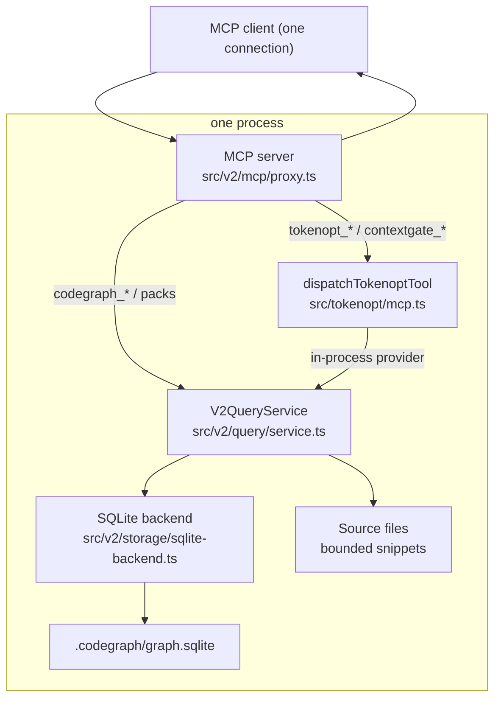
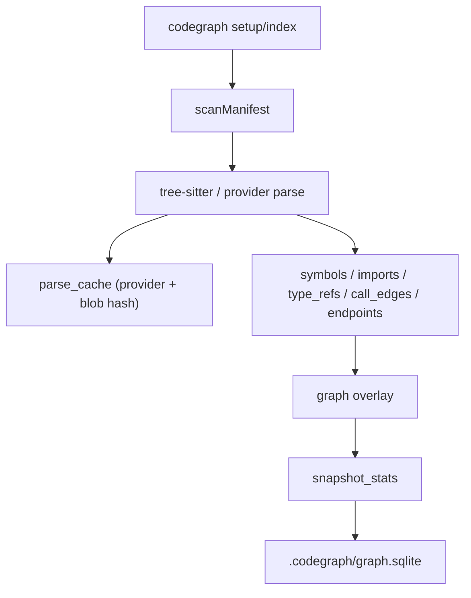

# CodeGraph Architecture

CodeGraph is a single-process, per-repository code intelligence tool. It runs as
one MCP stdio server and one CLI, backed by a repo-local SQLite database at
`<repo>/.codegraph/graph.sqlite`. There is no daemon, no HTTP hop, no Docker, and
no Postgres runtime dependency.

Since the TokenOpt/ContextGate fusion, the same process also exposes the
TokenOpt evidence-gate tools. **One package, one MCP server, one CLI** — see
[Migration](MIGRATION.md) for what changed and why.

## Two tool surfaces, one server

The single `codegraph mcp` process serves two complementary surfaces over the
same stdio connection:

| Surface | Representative tools | Role |
| --- | --- | --- |
| **CodeGraph gate** (default `client` profile) | `codegraph_context`, `codegraph_slice`, `codegraph_checkpoint`, `codegraph_status` | PRIMARY entry point. `codegraph_context` classifies the task, requests an explicit Luna scope plan for ambiguous work, and returns one bounded evidence packet. Checkpoints are repo-local and versioned. |
| **ContextGate/TokenOpt gate** (`full` profile or `TOKENOPT_MCP_MODE`) | `contextgate_get_context`, `tokenopt_compile_evidence`, `tokenopt_search`, `tokenopt_read_file` | Direct evidence-router surface for benchmark/power-user flows. Hidden by default so exactly one tool claims the first call. |

The gate enriches its own packets by calling the CodeGraph query engine
**in-process** (no subprocess, no second server). When `codegraph.enabled` is set,
`code_graph` evidence is folded directly into the gate packet, so the agent does
not pay for the same evidence twice.



### Why one server

Running CodeGraph and TokenOpt as two MCP servers on a multi-MCP host caused two
concrete problems: **decision overload** (the agent faced two overlapping
toolsets and defaulted to native file reads), and **double-spend** (both servers
served overlapping evidence for the same files). Fusing them yields one evidence
slot per source and one tool surface to reason about. See [Migration](MIGRATION.md).

## Package layout

```text
src/
  cli.ts                 Unified CLI entrypoint (codegraph + `gate` delegation)
  v2/
    mcp/proxy.ts         The single fused MCP server (both surfaces)
    query/handler-registry.ts  Snapshot-scoped tool handler dispatch
    query/service.ts     V2QueryService — all graph, pack, search, review tools
    query/review-manifest.ts  Source-free per-file/hunk review state machine
    application/review-use-case.ts  Shared immutable CLI/MCP review pipeline
    storage/             SQLite backend + schema
    infrastructure/process-runner.ts  Async bounded child-process boundary
    infrastructure/git-client.ts  Bounded async Git adapter
    infrastructure/github-pull-request-client.ts  Immutable GitHub PR metadata adapter
    infrastructure/review-workspace-provider.ts  Detached worktree/head safety adapter
    index/indexer.ts     Manifest scan, tree-sitter parse, snapshot writes
    benchmark/           Deterministic proof/eval/e2e harnesses
  tokenopt/              Vendored TokenOpt source (compiles to dist/tokenopt/*)

Review adapters (CLI and MCP) resolve transport input, then call
`ReviewPullRequestUseCase`; immutable source preparation, indexing, batching,
coverage and finding aggregation stay in that shared application pipeline.
    mcp.ts               TOKENOPT_TOOL_DEFINITIONS + dispatchTokenoptTool
    cli.ts               TokenOpt CLI surface, reached via `codegraph gate <…>`
    codegraph-bridge.ts  parseCodeGraphResult (reused by the in-process provider)
```

## Workspace layout (per repo)

```text
<repo>/
  .codegraph/            generated local state — do NOT commit
    graph.sqlite
    graph.sqlite-wal
    graph.sqlite-shm
    setup-state.json
    artifacts/<workspace-key>/context-index.v1.json
    logs/query.jsonl
    source-cache/
```

Add `.codegraph/` to `.gitignore`.

## Index flow



Key properties:

- Snapshots complete before any query reads them (`workspaces.current_snapshot_id`).
- Parse cache is keyed by provider and blob hash; warm setups reuse it.
- Small changed-file sets refresh incrementally; large changes rebuild a snapshot.
- `.git`, `.codegraph`, `.tmp*`, `node_modules`, `dist`, `build`, `target`,
  `coverage`, `.next`, `.turbo`, `.cache` are skipped during scans.

Indexed evidence covers Java/Jakarta, TypeScript/JavaScript, Python, JSON, YAML,
XML, and properties.

## Storage

`src/v2/storage/graph-backend.ts` defines the storage interface;
`sqlite-backend.ts` implements it with `better-sqlite3`.

SQLite pragmas:

```text
journal_mode = WAL
synchronous = NORMAL
foreign_keys = ON
temp_store = MEMORY
cache_size = -64000
mmap_size = 268435456
```

Core tables:

| Table | Purpose |
| --- | --- |
| `workspaces` | Workspace identity and current snapshot pointer. |
| `snapshots`, `snapshot_stats` | Point-in-time index metadata and aggregate counts. |
| `files` | Indexed files, roles, languages, parse status. |
| `parse_cache` | Provider-scoped parse results by blob hash. |
| `symbols` | Classes, methods, fields, functions, config symbols. |
| `imports`, `type_refs`, `field_usages` | Dependency evidence from source. |
| `call_edges`, `dependency_edges` | Graph relationships. |
| `graph_nodes`, `graph_edges` | Materialized overlay for graph export. |
| `endpoints`, `beans`, `annotations`, `inheritance` | Framework facts. |

## MCP tool handling

1. The server receives a `CallTool` request over stdio.
2. If the tool name is a `tokenopt_*` / `contextgate_*` name, it routes to
   `dispatchTokenoptTool` **before** the CodeGraph profile gate; the gate's
   in-process `codeGraphProvider` calls `V2QueryService` to fold in `code_graph`
   evidence.
3. Otherwise the request goes to `V2QueryService`, whose
   `QueryHandlerRegistry` dispatches the tool against one resolved snapshot;
   handlers run bounded SQL and read bounded source slices.
4. The server optionally checks freshness and refreshes inline when configured.
5. Telemetry and compact result summaries are logged to
   `.codegraph/logs/query.jsonl` for tool calls that pass through MCP.
6. JSON content is returned to the client.

Every CodeGraph response includes `_codegraph_meta` (`tool`, `duration_ms`,
`response_chars`, `tokens_est`, and item counts) for per-call cost tracking.

## Session evidence reuse

Pass a stable `sessionId` on every pack call and CodeGraph omits source bodies it
already delivered (`reusedFromEarlierCall`), cutting duplicate tokens across a
multi-step task. `freshEvidence: true` forces full bodies.

## What this is NOT

- No daemon process and no localhost HTTP API.
- No Postgres; the `pg` / `pg-copy-streams` runtime path was removed in favor of
  per-repo SQLite (`better-sqlite3`).
- No second MCP server for the evidence gate — it is fused in-process.

See [System & MCP usage](mcp-setup-and-usage.md) and the [CLI reference](cli.md).
