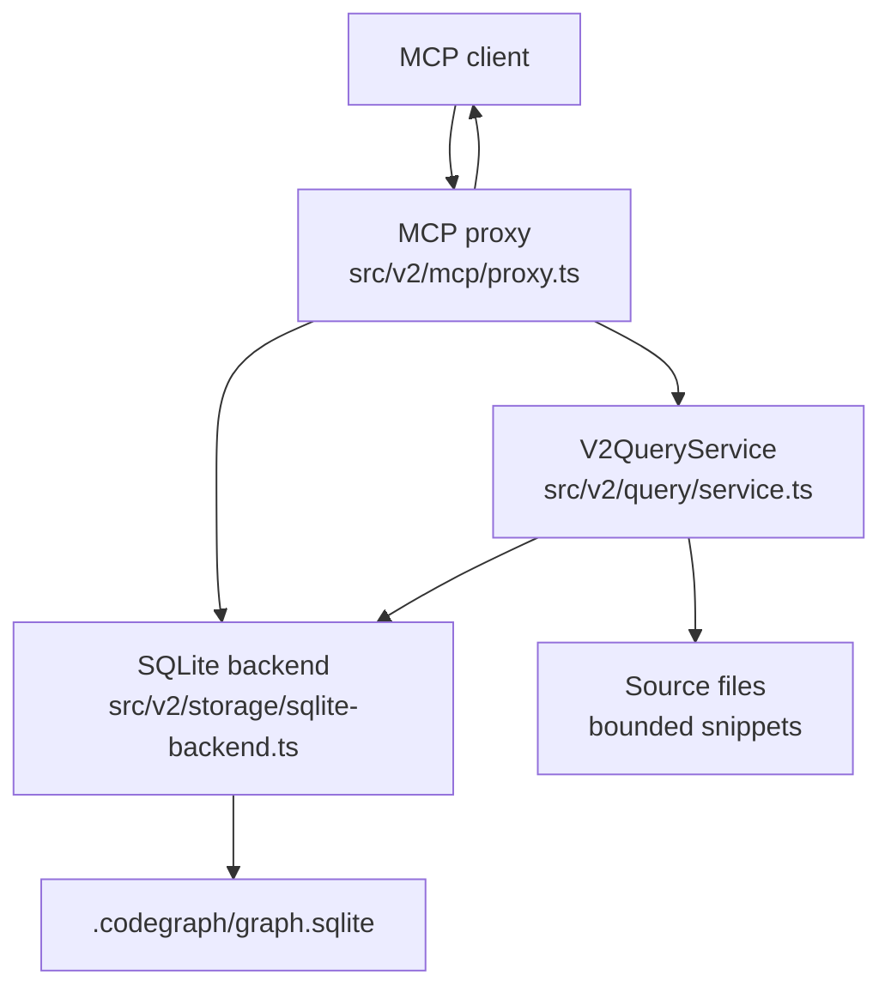
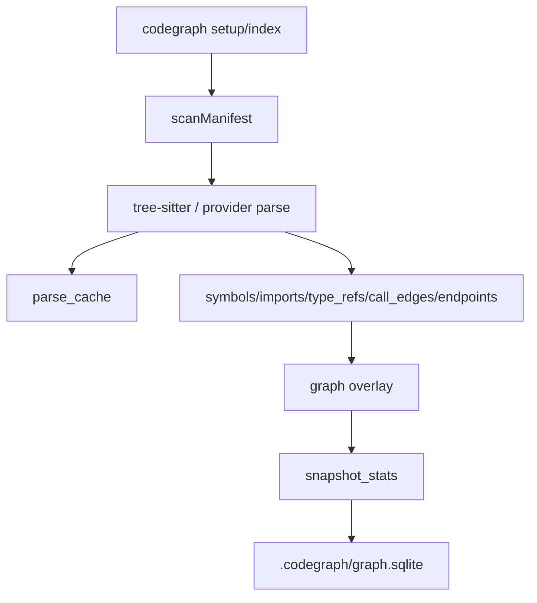

# CodeGraph Architecture

## Summary

CodeGraph now runs as a direct, per-workspace SQLite application:

- No daemon process.
- No HTTP localhost API.
- No Postgres.
- One database per repository at `<repo>/.codegraph/graph.sqlite`.
- MCP tool calls execute in the MCP process through `V2QueryService`.

## Workspace Layout

```text
<repo>/
  .codegraph/
    graph.sqlite
    graph.sqlite-wal
    graph.sqlite-shm
    setup-state.json
    artifacts/
      <workspace-key>/context-index.v1.json
    logs/
      query.jsonl
    source-cache/
  src/
  tests/
```

`.codegraph/` is generated local state and should be ignored by git.

## Runtime Flow



The stdio MCP handshake does not require a daemon. With `--prewarm`, MCP may index a missing workspace; otherwise the recommended path is to run `codegraph setup --root <repo>` first.

## Index Flow



Key properties:

- Snapshots are completed before queries use them.
- Parse cache is keyed by provider and blob hash.
- Small changed-file sets can update incrementally.
- `.codegraph`, `.tmp`, build, cache, and dependency directories are skipped during manifest scans.

## Storage

`src/v2/storage/graph-backend.ts` defines the storage interface. `src/v2/storage/sqlite-backend.ts` implements it with `better-sqlite3`.

SQLite settings:

```text
journal_mode = WAL
synchronous = NORMAL
foreign_keys = ON
temp_store = MEMORY
cache_size = -64000
mmap_size = 268435456
```

Important tables:

| Table | Purpose |
| --- | --- |
| `workspaces` | Workspace identity and current snapshot pointer. |
| `snapshots` | Point-in-time index metadata. |
| `snapshot_stats` | Aggregate counts and diagnostics. |
| `files` | Indexed files, roles, languages, parse status. |
| `parse_cache` | Provider-scoped parse results by blob hash. |
| `symbols` | Classes, methods, fields, functions, config symbols. |
| `imports`, `type_refs` | Dependency evidence extracted from source. |
| `call_edges`, `dependency_edges` | Graph relationships. |
| `graph_nodes`, `graph_edges` | Materialized overlay for graph export. |
| `endpoints`, `beans`, `annotations`, `inheritance` | Framework facts. |

## CLI Surface

```text
codegraph setup --root <repo>     index + local artifact
codegraph index --root <repo>     refresh SQLite graph
codegraph mcp --root <repo>       run direct MCP stdio proxy
codegraph doctor --root <repo>    inspect SQLite/artifact health
codegraph logs --root <repo>      read workspace query events
codegraph atlas --root <repo>     deterministic repo atlas
codegraph graph --root <repo>     static graph HTML export
codegraph benchmark ...           deterministic proof/eval/e2e harnesses
```

## MCP Tool Handling

1. MCP proxy receives a tool call over stdio.
2. Proxy optionally checks freshness and refreshes inline if configured.
3. Proxy routes the request to `V2QueryService`.
4. Query service runs bounded SQL and source-slice reads.
5. Proxy logs query telemetry to `.codegraph/logs/query.jsonl` when tool calls pass through MCP.
6. Proxy returns JSON content to the MCP client.

## Removed Components

The following runtime components were removed:

- `src/v2/daemon/client.ts`
- `src/v2/daemon/server.ts`
- `src/v2/daemon/types.ts`
- `src/v2/storage/postgres.ts`
- `src/v2/storage/postgres-schema.sql`
- `src/types/pg-copy-streams.d.ts`

NPM dependencies removed:

- `pg`
- `pg-copy-streams`
- `@types/pg`

NPM dependencies added:

- `better-sqlite3`
- `@types/better-sqlite3`

## Operational Notes

- Run `setup` once per repo before MCP for fastest startup.
- Use `index` after large branch changes or pulls.
- Use `--watch` or `--auto-refresh` for active edit sessions.
- Do not commit `.codegraph/`.
- For unusual mount paths, use `--workspace-key` to keep workspace identity stable.
