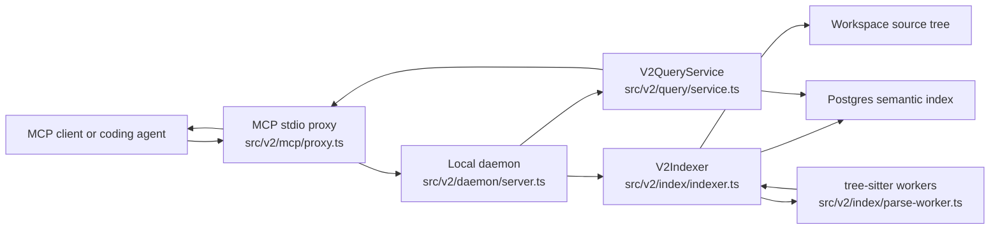
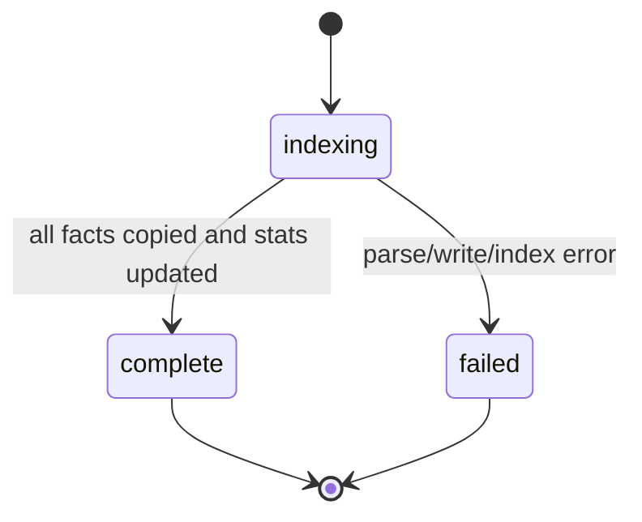
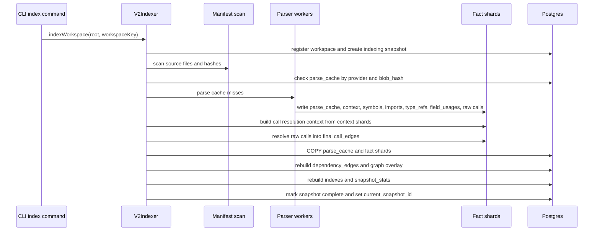
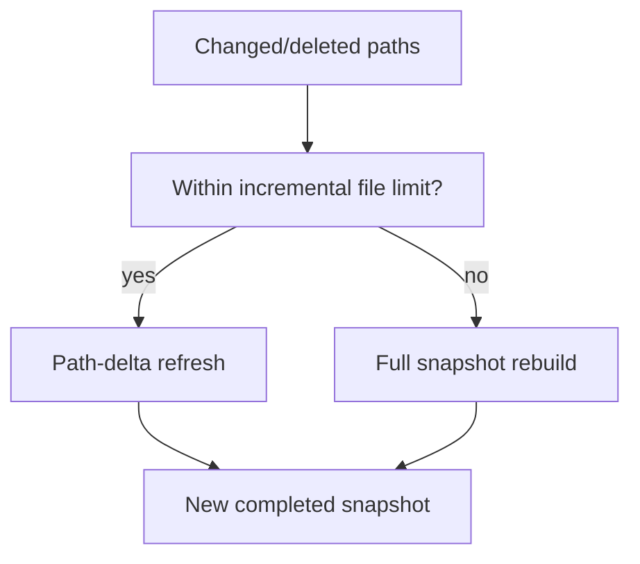
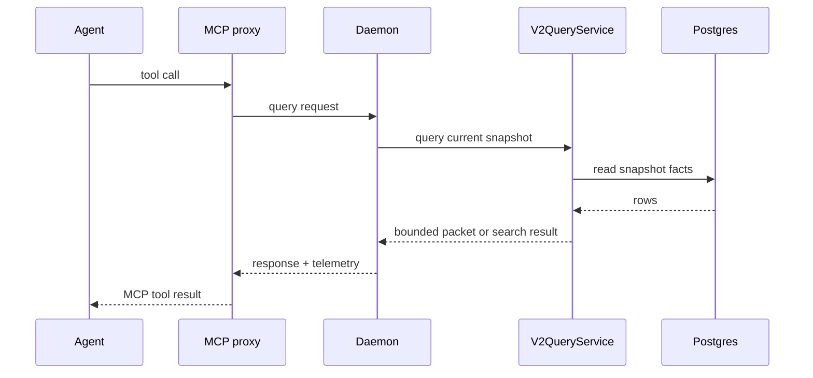

# CodeGraph System Design

This document explains how CodeGraph works internally: the runtime components, full cold index pipeline, snapshot model, query flow, refresh behavior, and performance choices.

## Goals

CodeGraph is designed to give coding agents graph-backed repository context without repeatedly scanning raw files.

Primary goals:

- Build a persistent semantic index for large repositories.
- Keep full cold index semantics: parse every supported file, keep full parse cache JSON, retain raw and low-signal call edges, and preserve full graph coverage.
- Serve MCP tools from completed snapshots only, so failed or in-progress indexing does not expose partial answers.
- Support fast repeated questions, code review packets, API flow tracing, dependency analysis, and impact analysis.
- Refresh small local edits incrementally while using full refresh for large checkout or pull changes.

Non-goals:

- CodeGraph is not a compiler-grade type checker.
- Java field usage indexing is syntactic impact analysis, not full alias or interprocedural dataflow.
- CodeGraph does not modify source files through MCP tools. It provides evidence for the agent.

## High-Level Architecture



| Component | Responsibility |
| --- | --- |
| CLI | Entry point for `index`, `mcp`, `daemon`, `graph`, `doctor`, `logs`, and benchmark commands. |
| MCP proxy | Exposes tool schemas over stdio and forwards requests to the local daemon. |
| Daemon | Owns workspace registration, optional file watching, refresh orchestration, and query routing. |
| Indexer | Builds full snapshots, performs incremental path refreshes, writes graph facts, and updates snapshot stats. |
| Parser workers | Parse source files with tree-sitter and emit parse results, context shards, and COPY-ready fact shards. |
| Graph overlay builder | Materializes lightweight module, file, endpoint, and symbol graph rows from completed snapshot facts. |
| Query service | Implements MCP tool behavior from indexed data and returns bounded agent-ready packets. |
| Postgres | Stores workspaces, snapshots, parse cache, files, symbols, imports, type refs, field usages, call edges, endpoints, beans, inheritance, dependency edges, graph overlay rows, and stats. |

## Runtime Modes

### Prewarm Index

```powershell
node dist/cli.js index --root "<project>" --workspace-key "<project-key>" --parse-workers 8
```

This command opens Postgres, registers the workspace, creates an indexing snapshot, parses source files, writes graph facts, and marks the snapshot current only after the full index succeeds.

### MCP Server

```powershell
node dist/cli.js mcp --root "<project>" --workspace-key "<project-key>"
```

The MCP server is a stdio process launched by a client such as Codex CLI, VS Code, GitHub Copilot, or another MCP client. It exposes tool schemas and completes the stdio handshake before doing daemon or workspace work. The daemon connection and workspace registration are initialized lazily on the first tool call so large repositories do not make MCP startup look like a tool-discovery failure.

For benchmark runs, the Codex E2E runner configures the MCP process with `--no-prewarm`. Indexing is measured as a separate phase, and agent runs do not silently start a full index inside a tool call.

### Watch And Auto Refresh

```powershell
node dist/cli.js mcp --root "<project>" --workspace-key "<project-key>" --watch
```

`--watch` batches local file changes and lets the daemon trigger path-delta refreshes. `--auto-refresh` checks freshness before tool calls and can refresh stale snapshots inline when the workspace is small enough.

## Workspace Identity

CodeGraph identifies workspaces by root and optional workspace key.

| Field | Purpose |
| --- | --- |
| `root` | Real source path seen by the process. |
| `workspace_key` | Stable logical identity, useful for Docker `/workspace` mounts or multiple worktrees. |
| `git_common_dir` | Helps distinguish worktrees that share the same Git object store. |
| `current_snapshot_id` | Points to the latest completed snapshot used by queries. |

Use a unique `CODEGRAPH_WORKSPACE_KEY` for each repository or worktree when paths can collide, especially in Docker.

## Snapshot Model

Every index creates a snapshot row.



Queries read only `workspaces.current_snapshot_id`, which points to a completed snapshot. A failed snapshot does not replace the current snapshot.

Snapshot metadata includes:

- Git branch and head commit when available.
- Tree and dirty hashes for freshness checks.
- File counts and parse cache hits.
- Provider ids and provider versions.
- Manifest scan and total index time.

Cached aggregate counts live in `snapshot_stats` so tools such as `get_index_stats` do not repeatedly count large tables.

## Full Cold Index Pipeline



### Manifest Scan

The manifest scan walks supported source/config files, computes file role, language, size, mtime, and blob hash, and detects changed/deleted paths for incremental paths.

Clean Git-tracked files can reuse Git blob ids. Dirty files are hashed from the working tree so local edits are represented correctly.

### Parse Cache

`parse_cache` is keyed by:

```text
provider_id + provider_version + blob_hash
```

Provider version changes intentionally invalidate old cached parse results when parser output shape changes. Java field usage indexing uses an opt-in provider version so default cold indexing does not regress.

### Worker Output

Workers parse files once and emit COPY-ready shard files:

- `parse_cache`
- context for call resolution
- `symbols`
- `imports`
- `type_refs`
- `annotations`
- `inheritance`
- `beans`
- `endpoints`
- `field_usages`
- raw call facts

This avoids keeping all parse results as large in-memory arrays in the main process.

### Persistent Architecture Graph Overlay

When `CODEGRAPH_ENABLE_GRAPH_OVERLAY=1` is set, CodeGraph rebuilds `graph_nodes` and `graph_edges` after the full facts are written for the completed snapshot. This overlay is derived data, not a replacement for `symbols`, `call_edges`, `dependency_edges`, `field_usages`, or `endpoints`.

Overlay nodes include:

- Workspace nodes.
- Module or service nodes inferred from build markers, Spring app roots, endpoint roots, and fallback directory roots.
- File nodes for indexed files.
- Important symbol nodes and endpoint nodes.

Overlay edges include:

- Workspace-to-module containment.
- Module-to-file containment.
- File-to-symbol and file-to-endpoint definitions.
- Endpoint-to-handler links.
- Cross-module aggregate edges from dependency edges, primary/provider call edges, endpoints, and field usages.

The overlay stores bounded evidence samples on aggregate edges instead of duplicating every raw call or reference row. Pack tools use it to add architecture context, bridge modules, and blast-radius summaries without repeatedly scanning large fact tables. For sharded full indexing, cross-file call aggregates are collected while streaming resolved raw call shards, avoiding a post-index scan over the full `call_edges` table. Incremental refresh rebuilds the overlay for the completed snapshot after path-delta facts are copied and refreshed when the overlay flag is enabled.

The overlay is currently opt-in because Hadoop benchmarking showed the full call-edge aggregate can exceed the performance gate on a very large repository. When overlay rows are absent, query tools and graph export keep their existing behavior and fall back to direct fact-table inference.

### Call Resolution

Call resolution uses a `CallResolutionContext` built from parsed symbols, imports, inheritance, receiver types, local variables, fields, and framework facts.

The resolver emits:

- Primary/provider call edges for higher-confidence graph traversal.
- Low-signal call edges retained for recall and hidden by default in some query paths.
- Signal reasons that explain why a call edge was kept or downgraded.

### Database Load

The indexer writes large tables through PostgreSQL `COPY`.

For sharded full indexing, the indexer copies shard files directly where possible. Write-heavy indexes can be dropped and rebuilt around bulk load when the configured path enables it.

COPY telemetry tracks attempts, successes, fallbacks, errors, rows, and milliseconds by table.

## Incremental Refresh

Small edits and deletes use `refreshWorkspacePaths`.



Incremental refresh copies unchanged rows from the previous snapshot, deletes stale rows for changed/deleted paths, parses changed files, resolves affected graph facts, writes a new snapshot, and updates `current_snapshot_id` only after success.

Large branch checkouts, pulls, rebases, generated-file bursts, or change sets above the limit should use a full explicit index.

## Query Flow



The query service uses graph-backed packets instead of broad raw file reads.

Common tools:

| Tool | Design intent |
| --- | --- |
| `get_research_pack` | Broad research and architecture context with ranked files and evidence. |
| `get_flow_pack` | API/method flow with entry point, callers/callees, dependencies, tests, and risks. |
| `get_change_pack` | Implementation planning with likely files, symbols, tests, validation hints, and field impact when available. |
| `review_patch` | Review packet from changed files, symbols, or diff, including findings and follow-up slices. |
| `find_references` | Definitions, calls, imports, and opt-in field usages. |
| `trace_dependencies` | Dependency or dependent traversal with depth and file-role filters. |
| `get_file_slice` | Bounded exact source slices after graph tools identify targets. |
| `get_index_stats` | Snapshot counts, freshness diagnostics, warnings, and telemetry. |

## Field Usage Indexing

Java field usage indexing is opt-in:

```powershell
$env:CODEGRAPH_ENABLE_FIELD_USAGES="1"
node dist/cli.js index --root "<project>" --workspace-key "<project-key>"
```

When enabled, the parser emits `field_usages` rows for Java field reads, writes, read-write updates, and initialization. Query tools can then answer impact questions such as:

```text
Where is BlockReceiver.datanode initialized, read, or written?
```

Field usage facts include:

- Field name and optional fully qualified owner.
- File, line, column, enclosing class, and enclosing symbol.
- Access kind: `read`, `write`, `read_write`, `init`, or `unknown`.
- Receiver text and resolution kind.
- Confidence score.

Default behavior hides low-confidence field usage rows unless the caller asks for low-signal evidence.

## Data Model

Core tables:

| Table | Contents |
| --- | --- |
| `workspaces` | Workspace identity and current snapshot pointer. |
| `snapshots` | Snapshot lifecycle, provider metadata, Git identity, and timing. |
| `snapshot_stats` | Cached counts and diagnostics for fast stats queries. |
| `files` | File manifest, roles, language, parse status, and blob hash. |
| `parse_cache` | Full parser JSON keyed by provider and blob hash. |
| `symbols` | Classes, methods, fields, functions, constants, and framework roles. |
| `imports` | Import statements and imported symbols. |
| `type_refs` | Referenced types and contexts. |
| `field_usages` | Opt-in Java field read/write/init facts. |
| `call_edges` | Caller/callee graph, confidence, resolution kind, and signal tier. |
| `dependency_edges` | File-level dependencies. |
| `graph_nodes` | Snapshot-scoped architecture overlay nodes for workspace, modules, files, endpoints, and key symbols. |
| `graph_edges` | Snapshot-scoped architecture overlay edges with bounded evidence samples. |
| `endpoints` | Framework endpoints such as REST handlers. |
| `annotations` | Symbol annotations. |
| `beans` | Framework bean/interface implementation facts. |
| `inheritance` | Class/interface inheritance relationships. |

Most graph tables cascade on snapshot deletion, so old snapshots can be cleaned without corrupting parse cache.

## Freshness And Correctness

Freshness checks compare the current workspace state with snapshot metadata.

| Case | Behavior |
| --- | --- |
| Warm unchanged workspace | Reuses parse cache and current snapshot facts. |
| Small edit/delete with `--watch` | Queues path-delta refresh. |
| `autoRefresh=true` on small stale snapshot | Refreshes inline before answering. |
| Large repo over auto-refresh limit | Returns a stale warning instead of doing expensive inline work. |
| Large branch checkout or pull | Requires explicit `index --root ...`. |
| Failed refresh | Keeps previous completed snapshot current. |

This is why CodeGraph can keep answers consistent even while a new snapshot is being built.

## Performance Design

Key performance choices:

- Parse workers parallelize CPU-heavy parsing.
- Parse cache avoids reparsing unchanged blobs across snapshots.
- Fact shards avoid building giant `ParseResult[]` structures in the main process.
- PostgreSQL `COPY` writes large fact tables efficiently.
- `snapshot_stats` avoids repeated aggregate counts over large graph tables.
- Query packets are bounded by token budgets and evidence windows.
- Low-signal call edges are retained for recall but hidden by default where precision matters.

Known expensive phases on large Java repositories:

- Tree-sitter parsing when parse cache is cold.
- Full `parse_cache.parse_json` COPY because it writes large JSON blobs.
- Full index rebuild around bulk graph writes.

CodeGraph intentionally keeps full parse cache and full graph coverage by default instead of trading correctness for speed.

## Failure Handling

| Failure | Handling |
| --- | --- |
| Parse failure for one file | Records parse status and continues when possible. |
| Worker/shard failure | Fails the indexing snapshot and keeps previous current snapshot. |
| COPY fallback | Preserves correctness and records telemetry. |
| Daemon restart | Reuses Postgres state and current snapshots. |
| MCP startup without index | Tools report missing snapshot; first-time index must be explicit. |

## Configuration Surface

Common CLI flags:

| Flag | Purpose |
| --- | --- |
| `--root` | Source workspace root. |
| `--workspace-key` | Stable logical workspace identity. |
| `--parse-workers` | Number of parse workers for cache misses. |
| `--watch` | Watch local file changes and refresh changed paths. |
| `--auto-refresh` | Refresh stale snapshots inline when safe. |
| `--refresh-on-start` | Queue a refresh when MCP starts. |
| `--warn-stale` | Include stale warnings in tool responses. |
| `--mcp-tools` | Restrict exposed MCP tools. |

Important environment variables:

| Variable | Purpose |
| --- | --- |
| `CODEGRAPH_DATABASE_URL` | Postgres connection string. |
| `CODEGRAPH_HOME` | Daemon metadata and log directory. |
| `CODEGRAPH_WORKSPACE_KEY` | Stable workspace key. |
| `CODEGRAPH_ENABLE_FIELD_USAGES` | Enables opt-in Java field usage indexing. |
| `CODEGRAPH_ENABLE_GRAPH_OVERLAY` | Enables opt-in persistent architecture overlay rows. |
| `CODEGRAPH_AUTO_REFRESH` | Enables auto-refresh for MCP. |
| `CODEGRAPH_WATCH` | Enables watch mode for MCP. |
| `CODEGRAPH_QUERY_FRESHNESS_CACHE_MS` | Optional cache for query freshness checks. |

## Observability

The index command prints phase progress to stderr and a final JSON result to stdout.

The daemon log records:

- Workspace registration.
- Tool name and arguments.
- Query duration.
- Response size.
- Estimated input/output tokens.
- Required/follow-up tool hints.
- Quality signals such as validation, likely tests, and compressed evidence.

Inspect logs with:

```powershell
node dist/cli.js logs --tail 50
```

## Typical End-To-End Flow

1. User runs a full cold index for a repository.
2. CodeGraph creates a complete snapshot in Postgres.
3. User starts an MCP client configured with the same root and workspace key.
4. Agent asks a tool such as `get_flow_pack`.
5. Query service reads the current completed snapshot.
6. Agent receives a bounded graph-backed packet.
7. Agent uses `get_file_slice` only when exact source is needed.
8. User edits files or checks out a branch.
9. Watch/auto-refresh handles small edits; explicit index handles large changes.

## Related Documents

- [MCP Setup And Usage](mcp-setup-and-usage.md)
- [Using CodeGraph MCP Correctly](using-codegraph-mcp-correctly.md)
- [Ticket-Driven Agent Workflow](ticket-driven-agent-workflow.md)
- [CodeGraph Prompt Guide](prompt-guide.md)
- [Benchmark Results](benchmark-results.md)
