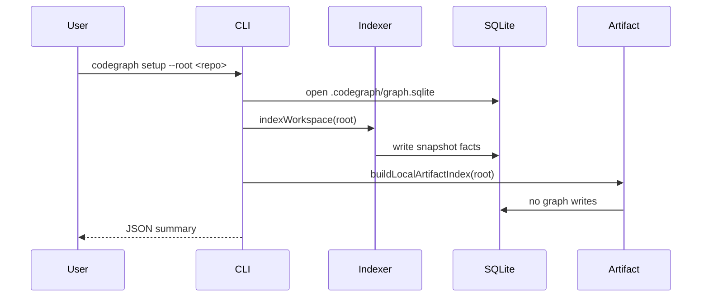
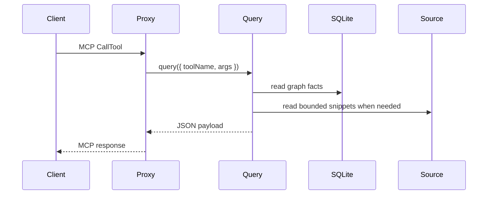

# System Design

CodeGraph is a single-process local graph index and MCP server. The active design is per-repository SQLite with direct query execution.

## Components

| Component | File(s) | Responsibility |
| --- | --- | --- |
| CLI | `src/cli.ts` | Parses commands, opens workspace DB, runs setup/index/MCP/benchmarks. |
| Paths | `src/v2/paths.ts` | Resolves `<repo>/.codegraph` paths. |
| SQLite backend | `src/v2/storage/sqlite-backend.ts` | Owns schema, migrations, prepared statements, bulk inserts, WAL config. |
| Indexer | `src/v2/index/indexer.ts` | Scans manifests, parses files, writes snapshots and graph facts. |
| Query service | `src/v2/query/service.ts` | Implements all graph, pack, search, review, and diagnostics tools. |
| MCP proxy | `src/v2/mcp/proxy.ts` | Exposes tool schemas over stdio and calls `V2QueryService` directly. |
| Local artifact | `src/v2/mcp/local-artifact.ts` | Builds compact context artifact during `setup`. |
| Local fallback | `src/v2/mcp/local-fallback.ts` | Provides filesystem fallback packets when graph facts are missing. |
| Benchmarks | `src/v2/benchmark/*` | Deterministic index/eval/proof/review/fallback/e2e harnesses. |

## Data Model

Each repo has:

```text
.codegraph/
  graph.sqlite
  artifacts/
  logs/
  setup-state.json
```

The database stores snapshots. Queries read the current completed snapshot through `workspaces.current_snapshot_id`.

Core tables:

- `files`
- `parse_cache`
- `symbols`
- `imports`
- `type_refs`
- `field_usages`
- `call_edges`
- `dependency_edges`
- `graph_nodes`
- `graph_edges`
- `endpoints`
- `beans`
- `inheritance`
- `snapshot_stats`

## Setup Path



## MCP Path



No daemon is started. No network request is made between proxy and query service.

## Freshness

Freshness compares snapshot git metadata with the current workspace state.

- `codegraph index --root <repo>` creates or refreshes a snapshot.
- MCP `--auto-refresh` can refresh stale snapshots before tool calls.
- MCP `--watch` batches file changes and refreshes changed paths.
- Large changes fall back to a full snapshot rebuild.

## Skip Policy

Manifest and local scanners skip generated/local state:

- `.git`
- `.codegraph`
- `.tmp*`
- `node_modules`
- `dist`
- `build`
- `target`
- `coverage`
- `.next`
- `.turbo`
- `.cache`

This keeps benchmarks and indexes scoped to source rather than prior run artifacts.

## Validation

Use:

```powershell
npm run lint
npm run build
npm test
node dist/cli.js benchmark index --root .
node dist/cli.js benchmark eval --root .
node dist/cli.js benchmark proof --root . --tasks auto --task-count 5 --no-index
node dist/cli.js benchmark review --root . --tasks auto --task-count 5 --no-index
node dist/cli.js benchmark fallback --root . --tasks auto --task-count 5
```
