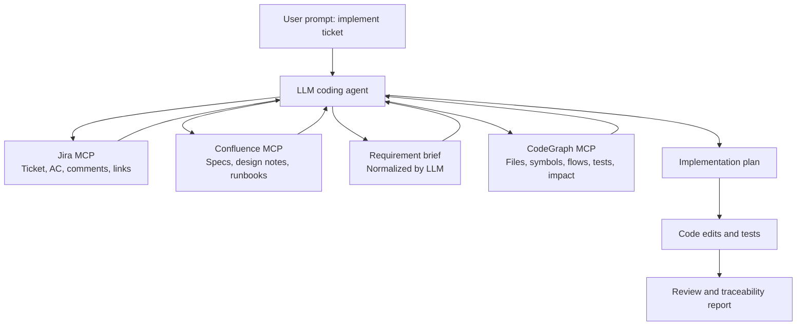

# Ticket-Driven Agent Workflow

This guide shows how to prompt an AI coding agent when the task starts from a Jira ticket and linked Confluence documentation, then needs to map requirements into code with CodeGraph MCP.

CodeGraph does not provide Jira or Confluence connectors by itself. This workflow assumes your agent has separate Jira and Confluence MCP servers configured, plus CodeGraph MCP for repository context.

## Mental Model

Jira and Confluence explain what should change. CodeGraph explains where and how that change maps into the repository.



The important rule is ordering:

1. Read Jira and Confluence first.
2. Normalize requirements into a concise brief.
3. Use CodeGraph MCP to map the brief to code.
4. Plan before editing.
5. Implement, test, and review against the original acceptance criteria.

Do not let the agent read Jira and Confluence, then search the repository blindly. Ask it to use CodeGraph after it understands the requirement.

## Required MCP Setup

| MCP server | Purpose |
| --- | --- |
| Jira MCP | Read ticket title, description, status, acceptance criteria, comments, labels, links, and related tickets. |
| Confluence MCP | Read linked product specs, design pages, runbooks, diagrams, and decision records. |
| CodeGraph MCP | Find files, symbols, APIs, field usages, flows, dependencies, tests, and review impact from the local repository snapshot. |

Before running implementation prompts, prewarm CodeGraph:

```powershell
node dist/cli.js index --root "<project>" --workspace-key "<project-key>" --parse-workers 8
```

For Java field impact tasks, enable field usage indexing before indexing:

```powershell
$env:CODEGRAPH_ENABLE_FIELD_USAGES="1"
node dist/cli.js index --root "<project>" --workspace-key "<project-key>" --parse-workers 8
```

## Phase 1: Understand The Ticket

Use this when the agent should read Jira and Confluence but not inspect code yet.

```text
Use Jira MCP and Confluence MCP to understand ticket <JIRA_KEY>.
Read the ticket description, acceptance criteria, comments, linked Confluence pages, and related docs.

Extract:
- goal
- acceptance criteria
- constraints
- non-goals
- open questions
- business terms
- likely affected domain

Do not inspect code yet.
Return a concise requirement brief with citations to the ticket or docs.
```

Expected output:

- Short ticket summary.
- Acceptance criteria as a checklist.
- Constraints and non-goals separated from desired behavior.
- Open questions clearly marked.
- Business terms that may not match code names.

## Phase 2: Map Requirements To CodeGraph

Use this after the requirement brief exists.

```text
Use the requirement brief from <JIRA_KEY>.
Now use CodeGraph MCP to map the requirement to the codebase.

Find:
- likely files
- classes, methods, fields, constants, APIs, and config keys
- relevant execution flows
- direct callers and callees
- dependencies and downstream clients
- likely tests and missing test coverage
- risks and compatibility concerns

Use shell only if CodeGraph evidence is missing.
Do not edit files yet.
Return target files, key symbols, relevant flows, tests, risks, missing evidence, and confidence.
```

Expected output:

- Repository-relative file paths.
- Key symbols with why they matter.
- Existing tests and test gaps.
- Confidence and missing evidence.

## Phase 3: Create An Implementation Plan

Use this before the agent edits files.

```text
Use Jira MCP, Confluence MCP, and CodeGraph MCP.
For ticket <JIRA_KEY>, create an implementation plan before editing.

Flow:
1. Read Jira ticket and linked Confluence docs.
2. Extract acceptance criteria and constraints.
3. Use CodeGraph MCP to map requirements to code files, symbols, flows, field usages, and tests.
4. Identify edge cases and compatibility risks.
5. Return an implementation checklist.

Do not edit files yet.
```

Expected output:

- Files to change.
- Symbols to change.
- Tests to add or update.
- Validation commands.
- Rollback or risk notes.
- Open questions that block implementation.

## Phase 4: Implement The Approved Plan

Use this only after the plan is accepted.

```text
Implement the approved plan for <JIRA_KEY>.
Use CodeGraph MCP before editing each affected area.
Keep the change minimal and scoped to the ticket.
Preserve existing behavior unless the ticket explicitly changes it.
Add or update focused tests.
Run the relevant tests.

Return:
- files changed
- requirement coverage
- tests run
- risks
- any incomplete items
```

Expected output:

- Code changes stay inside the planned scope.
- Tests are run or the reason they could not run is stated.
- Final response maps changes back to the ticket.

## Phase 5: Review Against The Ticket

Use this after a patch exists.

```text
Use Jira MCP and Confluence MCP to understand <JIRA_KEY>.
Then use CodeGraph MCP review_patch to review the current diff against the ticket requirements.

Findings first.
Each finding must include:
- severity
- violated acceptance criterion or risk
- affected file/method
- failure mode
- required fix
- required test

Also return AC -> code -> tests traceability.
```

Expected output:

- Finds code correctness issues.
- Finds requirement misses, not only generic code issues.
- Identifies missing test coverage.
- Produces traceability from acceptance criteria to files and tests.

## Prompt Templates By Task Type

### Full Ticket Implementation

```text
Use Jira MCP and Confluence MCP to understand <JIRA_KEY>.
Then use CodeGraph MCP to map the requirement to code files, symbols, flows, field usages, and tests.
Create an implementation plan first.
Do not edit files until the plan is complete.
Use shell only if CodeGraph evidence is missing.
```

### API Flow Ticket

```text
Use Jira MCP and Confluence MCP to understand <JIRA_KEY>.
Then use CodeGraph MCP to trace the full flow for API <METHOD /path>.

Include:
- route/handler
- request parsing
- validation
- service calls
- downstream clients or storage
- response construction
- cache keys
- tests
- risks

Create an implementation plan if the ticket requires code changes.
Do not edit until the plan is complete.
```

### Field Or Logic Impact Ticket

```text
Use Jira MCP and Confluence MCP to understand <JIRA_KEY>.
The ticket may change logic related to <Class.fieldOrMethod>.

Use CodeGraph MCP to find:
- definition
- reads, writes, and initialization usage
- enclosing methods/classes
- direct callers and callees
- related flows
- likely tests
- review risks

Return impact analysis first. Do not edit yet.
```

### Bug Investigation

```text
Use Jira MCP and Confluence MCP to understand bug ticket <JIRA_KEY>.
Then use CodeGraph MCP to investigate the likely root cause.
Trace the relevant code flow and compare expected behavior from the ticket/docs with actual code behavior.

Return:
- symptom
- expected behavior
- actual code path
- likely root cause
- affected files/methods
- tests that should cover it
- safest fix strategy

Do not edit files yet.
```

### Spec Or Product Requirement

```text
Use Jira MCP and Confluence MCP to read <JIRA_KEY> and linked product specs.
Normalize the requirement into acceptance criteria, non-goals, constraints, and open questions.
Then use CodeGraph MCP to map each acceptance criterion to likely files, symbols, flows, tests, and risks.

Return an implementation-ready spec.
Do not edit files.
```

### Test Planning

```text
Use Jira MCP and Confluence MCP to understand <JIRA_KEY>.
Use CodeGraph MCP to find existing tests and missing test cases for the affected files, symbols, APIs, and flows.

Return:
- existing tests to run
- new tests to add
- fixtures or mocks to reuse
- edge cases from the ticket/docs
- exact validation commands
```

### Code Review Against Ticket

```text
Use Jira MCP and Confluence MCP to understand <JIRA_KEY>.
Then use CodeGraph MCP review_patch to review this diff against the ticket and linked docs.

Findings first.
Each finding must include severity, violated requirement, affected file/method, failure mode, fix, and required test.

Return AC -> code -> tests traceability.
```

### Traceability Report

```text
Use Jira MCP, Confluence MCP, and CodeGraph MCP.
Create a traceability report for <JIRA_KEY> after the implementation.

Return a table:
- acceptance criterion
- code files changed
- key methods/classes
- tests added or run
- evidence
- status: covered / partial / missing

Also list remaining risks and follow-up work.
```

### Strict MCP-Only Benchmark

Use this to test tool quality without shell fallback.

```text
Use Jira MCP, Confluence MCP, and CodeGraph MCP only.
Do not use shell/read/write/edit.
For <JIRA_KEY>, produce an implementation-ready plan.

Return valid compact JSON with keys:
ticketSummary, acceptanceCriteria, confluenceEvidence, codegraphEvidence, targetFiles, keySymbols, flows, tests, risks, openQuestions, confidence.
```

## Output Formats

### Requirement Brief

```text
Return:
1. Ticket summary.
2. Acceptance criteria.
3. Constraints and non-goals.
4. Linked Confluence evidence.
5. Open questions.
6. Business terms that may map to code names.
```

### Implementation Plan

```text
Return:
1. Scope.
2. Files to change.
3. Symbols to change.
4. Flow impact.
5. Tests to add or run.
6. Validation commands.
7. Risks and rollback notes.
```

### Machine-Readable JSON

```text
Return valid compact JSON only with keys:
ticket, summary, acceptanceCriteria, constraints, codegraphEvidence, targetFiles, keySymbols, flows, tests, risks, openQuestions, confidence.
```

## Guardrails

Use these lines when the task is risky or broad:

```text
Do not edit files until the implementation plan is complete.
```

```text
If Jira or Confluence conflicts with the code, report the conflict instead of choosing silently.
```

```text
If the CodeGraph snapshot is stale, tell me what to re-index before answering.
```

```text
Use shell only after CodeGraph identifies missing evidence.
```

```text
Keep changes scoped to the ticket. Do not refactor unrelated code.
```

## Anti-Patterns

Avoid:

```text
Read the Jira ticket and implement it.
```

This lets the agent skip requirement normalization, code mapping, and test planning.

Prefer:

```text
Use Jira MCP and Confluence MCP to understand <JIRA_KEY>.
Then use CodeGraph MCP to map the requirement to files, symbols, flows, field usages, and tests.
Create an implementation plan before editing.
```

Avoid:

```text
Search the repo for everything related to this ticket.
```

Prefer:

```text
Use CodeGraph MCP first. Start with a graph pack for the ticket brief, then use bounded file slices only for missing evidence.
```

Avoid:

```text
Review this patch.
```

Prefer:

```text
Use Jira MCP and Confluence MCP to understand <JIRA_KEY>.
Use CodeGraph MCP review_patch to review the diff against the ticket acceptance criteria and linked docs.
```

## Quality Checklist

A good ticket-driven agent run should produce:

- Requirement brief with ticket/doc citations.
- Acceptance criteria mapped to code files and symbols.
- Implementation plan before edits.
- Relevant tests and missing test gaps.
- Final patch summary linked back to acceptance criteria.
- Review result that compares code behavior against the ticket, not only generic code style.
- Traceability table after implementation.

Stop and ask for clarification when:

- The ticket lacks acceptance criteria.
- Jira and Confluence disagree.
- The relevant CodeGraph snapshot is stale.
- The ticket requires data or permissions unavailable to the agent.
- The planned change touches unrelated subsystems.

## Related Documents

- [Using CodeGraph MCP Correctly](using-codegraph-mcp-correctly.md)
- [CodeGraph Prompt Guide](prompt-guide.md)
- [System Design](system-design.md)
- [Benchmark Results](benchmark-results.md)
